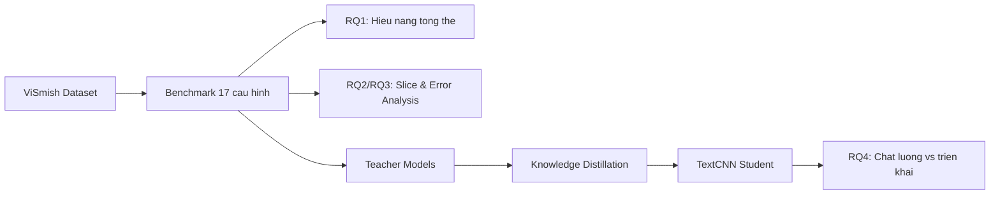
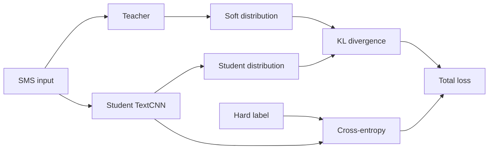

# Ke hoach slide thuyet trinh Chuong 4-5-6

Muc tieu: thuyet trinh phan Chuong 4, 5, 6 trong 5-7 phut, sau do chuyen sang demo. Phan bai toan va hai rao can da duoc nguoi thuyet trinh Chuong 1, 2, 3 trinh bay, nen phan nay bat dau truc tiep tu giai phap tong the va thiet ke thuc nghiem.

Trong flow nay, knowledge distillation phai duoc dat thanh mot nhanh chinh cua nghien cuu, khong xuat hien nhu mot thi nghiem phu. RQ3 duoc tach thanh hai slide vi phan nhom loi theo metadata v2 la insight quan trong va dang nhan manh truoc hoi dong.

Tinh than chung:

- Chuong 4 = thiet ke thuc nghiem.
- Chuong 5 = tra loi 4 cau hoi nghien cuu.
- Chuong 6 = ket luan dong gop va chuyen demo.
- RQ3 = khong chi dem loi, ma chi ra cac vung loi co y nghia theo metadata v2.

## Cau truc tong the

| Slide | Thoi luong | Vai tro |
|---|---:|---|
| 1. Giai phap tong the | 40s | Noi tiep Chuong 1-3, dat benchmark va distillation thanh 2 truc chinh |
| 2. Quy trinh thuc nghiem | 50s | Tom Chuong 4 |
| 3. RQ1-RQ2 | 60s | Mo hinh manh va vung du lieu kho |
| 4. RQ3a | 50s | Ho so loi: FP/FN, confidence cao, Jaccard overlap |
| 5. RQ3b | 70s | Bang nhom loi tieu bieu theo metadata v2 |
| 6. Co che Knowledge Distillation | 75s | Cong thuc loss va KL divergence |
| 7. RQ4 | 80s | Ket qua KD va trien khai |
| 8. Ket luan va demo | 30s | Chot Chuong 6, chuyen demo |

Tong thoi luong du kien: 6 phut 35-45 giay.

## Slide 1 - Giai phap tong the

### Muc tieu

Noi tiep phan nguoi truoc da trinh bay ve bai toan, du lieu va dong luc nghien cuu. Slide nay phai lam ro khoa luan co hai truc thuc nghiem: benchmark de danh gia mo hinh manh va distillation de huong toi mo hinh nhe.

### Nen co tren slide

Mot so do 2 nhanh:



### Keyword can nho

- Hai truc thuc nghiem
- Benchmark de tim mo hinh manh
- Slice/Error de hieu hanh vi mo hinh
- Distillation de chuyen tri thuc sang mo hinh nhe
- Khong phai thi nghiem phu

### Script goi y

Sau phan tong quan ve bai toan va bo du lieu, phan cua em tap trung vao thiet ke va ket qua thuc nghiem. Tong the nghien cuu duoc chia thanh hai truc. Truc thu nhat la benchmark nhieu nhom mo hinh de xac dinh mo hinh nao hoat dong tot tren du lieu smishing tieng Viet, dong thoi phan tich sau theo lat cat du lieu va loi sai. Truc thu hai la knowledge distillation. Sau khi co cac mo hinh teacher manh hon, em kiem tra lieu co the chuyen mot phan tri thuc cua teacher sang TextCNN, mot student nho gon hon, de phuc vu dinh huong trien khai hay khong. Nhu vay, distillation la mot nhanh chinh cua thiet ke thuc nghiem, khong phai phan bo sung roi rac.

## Slide 2 - Quy trinh thuc nghiem Chuong 4

### Muc tieu

Tom Chuong 4 trong mot slide: du lieu, split, mo hinh, metric, RQ.

### Nen co tren slide

Dung hinh quy trinh thuc nghiem tong the.

Ben canh hinh, chi de 4 dong:

- Dataset ViSmish: 10.562 mau.
- Chia train/dev/test co dinh.
- Benchmark 17 cau hinh mo hinh.
- Danh gia: Macro-F1, F1 Label 1, Recall Label 1, PR-AUC.

### Keyword can nho

- Protocol co dinh
- Dev de chon mo hinh
- Test de danh gia cuoi
- 4 RQ
- RQ4 la nhanh distillation rieng

### Script goi y

Ve thiet ke thuc nghiem, toan bo du lieu duoc chia thanh train, dev va test theo mot protocol co dinh. Tap dev duoc dung de chon checkpoint va phan tich hanh vi mo hinh, con tap test dung cho danh gia cuoi cung. Em benchmark 17 cau hinh thuoc nhieu nhom, tu mo hinh truyen thong, deep learning nhe, PLM cho tieng Viet, den LLM nho. Cac chi so chinh gom Macro-F1 de do can bang tong the, F1 va Recall cho lop smishing, cung PR-AUC de danh gia kha nang xep hang xac suat trong boi canh du lieu mat can bang. Rieng RQ4 duoc thiet ke thanh nhanh distillation rieng, co dinh student TextCNN va thay doi teacher cung chien luoc dung soft label.

## Slide 3 - RQ1 va RQ2: Mo hinh manh va vung du lieu kho

### Muc tieu

Khong doc bang dai. Chot insight chinh cua benchmark va slice analysis.

### Nen co tren slide

Bo cuc 2 nua:

- Trai: hinh benchmark 17 model.
- Phai: heatmap hoac 3 bullet RQ2.

Bullet goi y:

- Gemma 2B tot nhat tong the.
- DistilBERT manh ve Recall Label 1.
- Vung kho: SMS dai, khong URL, noi dung no/phi/phat/de doa.

### Keyword can nho

- Best overall
- Recall cho smishing
- Slice analysis
- Khong dong deu theo metadata

### Script goi y

Voi RQ1, ket qua benchmark cho thay khong co mot mo hinh duy nhat tot nhat tren moi khia canh, nhung Gemma 2B la mo hinh co hieu nang tong the noi bat nhat. DistilBERT lai dang chu y o Recall Label 1, tuc kha nang bat duoc nhieu tin nhan smishing hon.

Sang RQ2, khi phan tich theo lat cat du lieu, hieu nang mo hinh khong dong deu. Cac tin nhan co URL hoac loi keu goi nhan link thuong de nhan dien hon, vi co dau hieu be mat ro. Nguoc lai, cac tin nhan dai, khong chua URL, hoac lien quan den no, phi, phat, de doa thuong kho hon. Dieu nay cho thay benchmark tong the la chua du; can phan tich theo metadata de hieu mo hinh dang manh va yeu o dau.

## Slide 4 - RQ3a: Ho so loi va do giao thoa loi

### Muc tieu

Cho thay RQ3 khong chi nhin accuracy, ma di vao cau hoi "mo hinh sai nhu the nao". Slide nay la phan dinh luong: FP/FN, loi confidence cao, va Jaccard overlap.

### Nen co tren slide

Hinh chinh:

- Ho so loi va Jaccard/error overlap giua 4 mo hinh.

Them 3 bullet ngan:

- CafeBERT: it FP nhat nhung van co FN.
- DistilBERT: Recall cao hon nhung doi lai nhieu FP hon.
- TextCNN va TextCNN distilled co vung loi trung nhau rat cao.

Neu can chen so:

- CafeBERT: FP=2, FN=5.
- DistilBERT multilingual: FP=7, FN=2.
- TextCNN: FP=4, FN=7.
- TextCNN distilled: FP=6, FN=6.
- Jaccard TextCNN vs TextCNN distilled = 0,7692.
- Jaccard CafeBERT vs DistilBERT = 0,1429.

### Keyword can nho

- Error profile
- Confidence cao
- CafeBERT kiem soat FP
- DistilBERT nhay hon voi smishing
- TextCNN distilled chua doi hinh ranh gioi loi

### Script goi y

Voi RQ3, truoc het em nhin vao ho so loi tren tap dev. Ket qua cho thay moi mo hinh co kieu sai khac nhau. CafeBERT co so false positive thap nhat, tuc kha nang tranh canh bao nham tot hon. DistilBERT multilingual bat duoc nhieu smishing hon, nhung doi lai so false positive cao hon. Trong khi do, TextCNN va TextCNN distilled co vung loi giao nhau rat lon, voi Jaccard bang 0,7692.

Diem dang chu y la nhieu loi co confidence rat cao. Dieu nay cho thay mo hinh khong chi phan van o ranh gioi quyet dinh, ma co nhung mau bi hieu sai mot cach kha chac chan. Vi vay, em tiep tuc tach RQ3 sang phan dinh tinh theo metadata v2 de xem cac loi nay tap trung o nhung kieu tin nhan nao.

## Slide 5 - RQ3b: Nhom loi tieu bieu theo metadata v2

### Muc tieu

Day la slide insight "dat gia" cua RQ3. No cho thay loi FP/FN co the duoc giai thich bang to hop metadata v2, khong dung cac metadata cu nhu `category` hay `obfuscation_level`.

### Nen co tren slide

Dung mot bang rut gon tu Bang 5.10. Khong nen dua qua nhieu text; moi dong chi can "nhom loi - loai loi - metadata noi bat - y nghia".

Bang goi y:

| Nhom loi | Loai | Metadata noi bat | Y nghia |
|---|---:|---|---|
| Doi no khong URL | FN | `debt_collection`, `debtor`, `has_url=false`, `threat/fear/authority` | Giong thong bao nhac no hop le, thieu tin hieu URL |
| Link-lure giong thong bao dich vu | FN | `banking_finance/commerce`, `has_url=true`, `link_lure/urgency/authority` | Qua giong canh bao giao dich, bao mat, giao hang |
| Mien nhay cam nhieu nhieu | FN | `gambling/adult_service`, obfuscation cao, teencode/chen ky tu | Tin hieu smishing bi phan manh |
| Hoi thoai ca nhan phi chuan | FP | `personal_social`, `actions=none`, khong URL/phone, teencode | Cam xuc/van ban phi chuan kich hoat nham |
| Tuyen sinh/hoi thao hop le | FP | `employment`, `student`, dang ky/lien he/link | Hard negative vi co loi moi va yeu cau thong tin |
| Brandname/co quan co link/authority | FP | `public_service/commerce`, brandname, `authority/link_lure` | Link/authority khong du de ket luan smishing |

### Keyword can nho

- Metadata v2 by sample_id
- To hop metadata, khong phai mot nhan don
- FN = smishing tinh vi hoac bi nhieu
- FP = hard negative hop le
- Huong cai thien: bo sung hard positives/hard negatives

### Script goi y

Sau khi anh xa cac mau loi sang metadata v2 bang sample_id, em nhan thay cac loi khong tach ro theo mot nhan don le, ma thuong gom theo to hop metadata. Voi false negative, co ba nhom dang chu y. Nhom thu nhat la smishing doi no khong co URL, danh vao vai tro con no va dung ngon ngu de doa hoac phap ly. Nhom nay de bi xem nhu thong bao nhac no hop le. Nhom thu hai la cac tin co link nhung mo phong qua giong thong bao giao dich, bao mat hoac giao hang. Nhom thu ba la cac mien nhay cam co nhieu be mat cao, lam tin hieu smishing bi phan manh.

Voi false positive, cac loi tap trung vao hard negative hop le. Do la hoi thoai ca nhan phi chuan khong co hanh dong yeu cau, tin tuyen sinh hoac hoi thao co link dang ky, va thong bao brandname hoac co quan co yeu to authority. Cac nhom nay quan trong vi chung cho thay mo hinh co xu huong danh dong link, brandname, authority hoac ngon ngu phi chuan voi smishing.

Ket luan cua RQ3 la de cai thien mo hinh, khong nen chi tang du lieu theo nhan 0/1. Can bo sung dung cac hard positives va hard negatives theo cac to hop metadata v2 nay.

## Slide 6 - Co che Knowledge Distillation

### Muc tieu

Dap ung yeu cau dien giai cong thuc loss va KL divergence, nhung khong sa vao toan qua lau.

### Nen co tren slide

Bo cuc 2 cot.

Cot trai: so do teacher-student.



Cot phai: cong thuc.

```text
L = (1 - alpha) CE(y, p_s)
    + alpha T^2 KL(p_t^T || p_s^T)

p_t^T = softmax(z_t / T)
p_s^T = softmax(z_s / T)
```

```text
KL(p_t || p_s)
= sum_i p_t(i) log(p_t(i) / p_s(i))
```

### Keyword can nho

- Hard label
- Soft distribution
- Teacher uncertainty
- KL do do lech phan phoi
- Alpha va Temperature

### Script goi y

Trong knowledge distillation, student khong chi hoc tu nhan cung 0 hoac 1 nhu huan luyen thong thuong. Student con hoc tu phan phoi xac suat mem do teacher tao ra. Phan phoi nay chua them thong tin ve muc do khong chac chan cua teacher. Vi du, voi mot SMS, teacher co the khong chi noi day la smishing, ma con the hien muc tin cay tuong doi giua hai lop.

Ham mat mat gom hai thanh phan. Thanh phan thu nhat la cross-entropy giua nhan that va du doan cua student, giup student van bam vao ground truth. Thanh phan thu hai la KL divergence giua phan phoi cua teacher va student sau khi lam mem bang temperature T.

KL divergence do do lech khi dung phan phoi cua student de xap xi phan phoi cua teacher. Trong ngu canh nay, teacher la phan phoi tham chieu, con student duoc toi uu de phan phoi du doan gan teacher hon. Tham so alpha dieu chinh muc do tin vao teacher, con temperature T lam mem phan phoi de truyen duoc nhieu thong tin hon so voi nhan cung.

## Slide 7 - RQ4: Ket qua Distillation va trien khai

### Muc tieu

Tra loi ro: KD co giup khong, giup khi nao, va y nghia trien khai la gi.

### Nen co tren slide

Hinh chinh:

- Recall delta RQ4.

Kem bang mini 3 dong:

| Teacher | KD tot nhat | Insight |
|---|---|---|
| PhoBERT-base | Risk-aware KD | Tang Recall ro nhat |
| CafeBERT | Vanilla KD | Co loi nhung khac co che |
| ViCLSR | Khong on dinh | Khong phai teacher nao cung tot |

Mot box nho:

> TextCNN: ~0.342 MB, latency khoang 1-2 ms  
> KD cai thien chat luong du doan, khong lam model nho hon.

### Keyword can nho

- Distillation co dieu kien
- Teacher matters
- Soft label strategy matters
- TextCNN nhe nho kien truc
- KD giup quality, khong giup size

### Script goi y

Voi RQ4, em co dinh student la TextCNN va thay doi teacher cung nhu cach dung soft label. Ket qua cho thay distillation khong phai luc nao cung cai thien. Hieu qua phu thuoc vao teacher va chien luoc distillation.

Voi PhoBERT-base, risk-aware KD cho cai thien Recall Label 1 ro nhat, tuc giup student bat duoc nhieu smishing hon. Voi CafeBERT, vanilla KD lai phu hop hon. Trong khi do, ViCLSR khong dem lai loi ich on dinh cho student. Dieu nay cho thay teacher manh chua chac luon la teacher phu hop; phan phoi mem cua teacher phai huu ich voi student.

Ve trien khai, TextCNN co kich thuoc rat nho va do tre thap. Tuy nhien, diem quan trong la mo hinh nhe la nho kien truc TextCNN, con distillation khong lam model nho hon. Vai tro cua distillation la cai thien chat luong du doan cua mo hinh nhe, dac biet o kha nang nhan dien lop smishing.

## Slide 8 - Ket luan va chuyen demo

### Muc tieu

Chot Chuong 6 va chuyen sang demo muot.

### Nen co tren slide

3 dong gop:

- Xay dung va danh gia ViSmish tren nhieu nhom mo hinh.
- Phan tich hanh vi mo hinh qua slice va FP/FN metadata v2.
- Danh gia distillation cho mo hinh nhe huong trien khai.

1 han che/future work:

- Can mo rong du lieu thuc te va kiem thu trien khai tren thiet bi that.

### Keyword can nho

- Ba dong gop
- Benchmark
- Error analysis
- Distillation for deployment
- Demo minh hoa pipeline

### Script goi y

Tom lai, khoa luan co ba ket qua chinh. Thu nhat, em xay dung va danh gia bai toan phat hien smishing tieng Viet tren nhieu nhom mo hinh khac nhau. Thu hai, em khong chi bao cao diem so tong the ma con phan tich hanh vi mo hinh qua cac lat cat du lieu va loi FP/FN theo metadata v2. Thu ba, em danh gia knowledge distillation nhu mot huong dua nang luc cua mo hinh manh sang mo hinh nhe hon, phuc vu dinh huong trien khai.

Sau phan ket qua thuc nghiem, em xin chuyen sang phan demo de minh hoa luong phat hien smishing tren mot so tin nhan dau vao.

## Flow noi lien mach can nho

1. Noi tiep tu Chuong 1-3.
   - Bai toan, dong luc va du lieu da duoc gioi thieu; phan nay bat dau tu giai phap thuc nghiem.
2. Lam theo huong nao?
   - Benchmark de biet mo hinh nao manh; distillation de chuyen tri thuc sang mo hinh nhe.
3. Thuc nghiem ra sao?
   - ViSmish, train/dev/test, 17 cau hinh, 4 RQ.
4. Ket qua chinh la gi?
   - Gemma manh tong the; slice cho thay vung kho; RQ3 giai thich cac nhom loi; KD co dieu kien.
5. Y nghia la gi?
   - Khong chi tim model tot, ma hieu model sai o dau va kiem tra kha nang trien khai nhe.

## Cau chuyen slide nen dung

Mo dau phan cua minh:

> Sau khi phan truoc da trinh bay bai toan, dong luc va bo du lieu, em se di vao thiet ke thuc nghiem va cac ket qua chinh cua Chuong 4, 5 va 6.

Tu slide 1 sang 2:

> De hai truc nay duoc danh gia nhat quan, em xay dung quy trinh thuc nghiem nhu sau.

Tu slide 2 sang 3:

> Tren protocol do, em lan luot tra loi cac cau hoi nghien cuu, bat dau tu hieu nang tong the va cac lat cat du lieu.

Tu slide 3 sang 4:

> Sau khi biet mo hinh nao manh va vung du lieu nao kho, cau hoi tiep theo la cac mo hinh dang sai o dau.

Tu slide 4 sang 5:

> Cac con so FP/FN cho biet muc do loi, con bang nhom loi theo metadata v2 cho biet ban chat cua cac loi nay.

Tu slide 5 sang 6:

> Sau khi hieu mo hinh manh o dau va sai o dau, phan tiep theo la kiem tra lieu tri thuc cua mo hinh manh co the chuyen sang mo hinh nhe hon hay khong.

Tu slide 6 sang 7:

> Tu co che distillation nay, cau hoi thuc nghiem la teacher nao va chien luoc soft label nao that su giup student tot hon.

Tu slide 7 sang 8:

> Nhu vay, distillation khong thay the benchmark, ma bo sung mot nhanh trien khai cho toan bo nghien cuu.

## Nhung cau dat gia nen thuoc

- Distillation la mot nhanh chinh cua thiet ke thuc nghiem, khong phai phan bo sung roi rac.
- Benchmark cho biet mo hinh nao manh; slice va error analysis cho biet mo hinh manh/yeu o dau.
- RQ3 cho thay loi FP/FN khong ngau nhien, ma tap trung vao cac to hop metadata v2 co y nghia.
- False negative la cac smishing tinh vi hoac bi nhieu; false positive la cac hard negative hop le co dau hieu giong smishing.
- KL divergence do do lech giua phan phoi mem cua teacher va student, trong do teacher dong vai tro phan phoi tham chieu.
- Distillation co dieu kien: hieu qua phu thuoc vao teacher va cach dung soft label.
- TextCNN nhe la do kien truc; KD khong lam mo hinh nho hon, ma giup cai thien chat luong du doan cua mo hinh nhe.
- Muc tieu cuoi cung khong chi la dat diem so cao, ma la hieu va tien gan hon toi kha nang trien khai thuc te.

## Ghi chu cap nhat

- Slide bai toan va hai rao can da bo vi nguoi thuyet trinh Chuong 1, 2, 3 da dam nhan.
- Neu can rut xuong 5 phut: rut ngan Slide 3 va Slide 4, nhung khong cat Slide 5, 6 hoac 7.
- Neu bi qua thoi gian o RQ3: Slide 5 chi can noi 3 cum: FN khong URL/noi dung bi nhieu; FP hard negative hop le; cai thien bang hard positives/hard negatives theo metadata v2.
- Neu hoi dong quan tam toan: uu tien giai thich KL divergence va temperature o Slide 6.
- Neu hoi dong quan tam ung dung: uu tien nhan manh TextCNN nhe/nhanh va KD chi cai thien quality, khong giam size.
