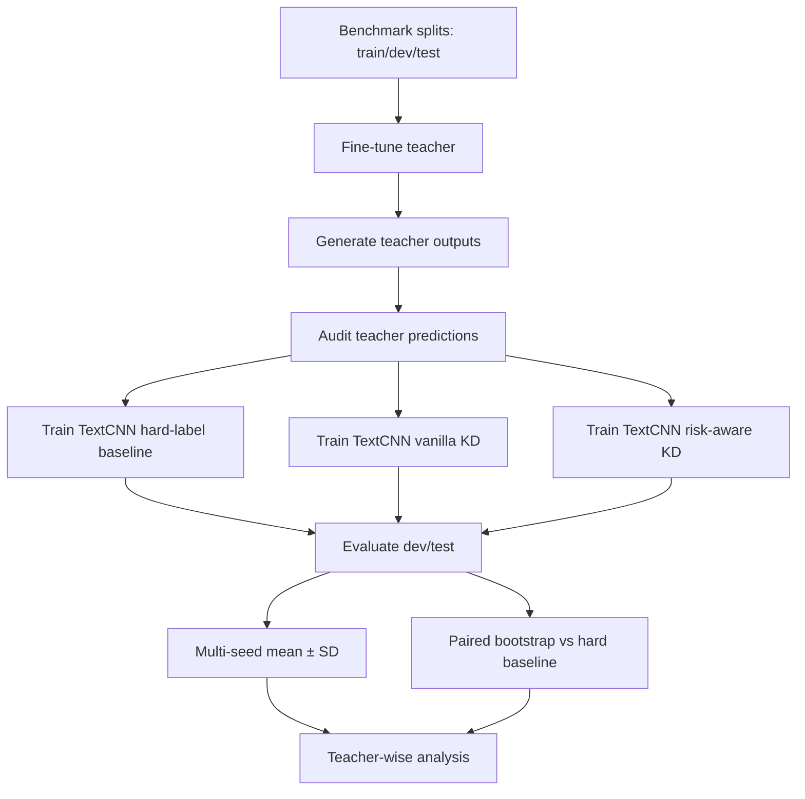

# Báo cáo phân tích Knowledge Distillation với ba teacher

## 1. Mục tiêu thí nghiệm

Thí nghiệm này đánh giá khả năng dùng các mô hình ngôn ngữ lớn hơn làm
`teacher` để truyền tín hiệu học cho một mô hình nhẹ hơn là TextCNN. Ba teacher
được phân tích gồm:

- PhoBERT-base;
- CafeBERT;
- ViCLSR.

Mục tiêu không phải chứng minh teacher nào mạnh nhất tuyệt đối, mà là kiểm tra
câu hỏi hẹp hơn:

> Với cùng một kiến trúc student TextCNN, soft label từ từng teacher có giúp
> student tốt hơn hard-label baseline hay không, đặc biệt trên lớp smishing
> (`label=1`)?

Các thí nghiệm dùng cùng bộ benchmark split:

```text
data/distillation/benchmark_splits/
├── train.csv
├── dev.csv
└── test.csv
```

Mỗi split có schema tối thiểu:

```text
sample_id,content,label
```

Teacher outputs dùng cho distillation gồm:

```text
teacher_logit_0
teacher_logit_1
teacher_p0_t1
teacher_p1_t1
teacher_p0_t2
teacher_p1_t2
teacher_temperature
teacher_pred
teacher_confidence
teacher_agree_label
distill_weight
```

Trong đó, `teacher_p1_t2` là soft target chính cho student, còn
`distill_weight` điều chỉnh mức độ tin vào teacher ở từng mẫu.

## 2. Cơ sở lý thuyết

### 2.1. Knowledge distillation

Knowledge distillation là kỹ thuật huấn luyện một mô hình nhỏ hơn (`student`)
học từ tín hiệu đầu ra của một mô hình lớn hơn hoặc mạnh hơn (`teacher`). Thay
vì chỉ học từ nhãn cứng `0/1`, student học thêm phân bố xác suất của teacher.

Trong bài toán nhị phân:

```text
y_i ∈ {0, 1}
q_i = P_teacher(label=1 | x_i)
p_i = P_student(label=1 | x_i)
```

Huấn luyện hard-label thông thường chỉ dùng:

```text
L_hard = BCE(y_i, p_i)
```

Distillation bổ sung:

```text
L_soft = BCE(q_i, p_i)
```

Loss tổng:

```text
L_total = α * L_hard + (1 - α) * w_i * L_soft
```

Trong thí nghiệm này:

- `α = 0.8`;
- `q_i = teacher_p1_t2`;
- `w_i = distill_weight`;
- `T = 2` được dùng khi sinh soft label từ teacher logits.

### 2.2. Vì sao soft label có ích

Nhãn cứng chỉ cho biết mẫu thuộc lớp nào. Soft label cho biết thêm mức độ chắc
chắn của teacher. Ví dụ:

| Nội dung | Nhãn cứng | Teacher p(label=1) | Diễn giải |
|---|---:|---:|---|
| SMS lừa đảo rất rõ ràng | 1 | 0.99 | Mẫu xa decision boundary |
| SMS đáng ngờ nhưng chưa rõ | 1 | 0.62 | Mẫu gần decision boundary |
| SMS OTP hợp lệ | 0 | 0.03 | Mẫu âm rõ ràng |
| SMS hợp lệ nhưng có link | 0 | 0.35 | Mẫu âm dễ gây nhầm |

Thông tin này thường được gọi là `dark knowledge`: tri thức nằm trong phân bố
xác suất của teacher, không nằm trong nhãn đúng/sai đơn lẻ. Với bài toán nhị
phân smishing, `dark knowledge` thể hiện chủ yếu qua độ chắc chắn, độ nhập
nhằng và khoảng cách tới ranh giới quyết định.

### 2.3. Temperature

Teacher sinh logits:

```text
z = [z_0, z_1]
```

Softmax với temperature:

```text
p_i(T) = exp(z_i / T) / Σ_j exp(z_j / T)
```

Khi `T > 1`, phân bố xác suất mềm hơn. Điều này giúp student nhìn thấy nhiều
thông tin hơn so với xác suất quá cực đoan ở `T = 1`.

Trong thí nghiệm:

- `teacher_p1_t1` dùng để đo confidence/prediction thông thường;
- `teacher_p1_t2` dùng làm soft target cho distillation.

### 2.4. Risk-aware distillation

Không phải mọi teacher output đều đáng tin như nhau. Nếu teacher dự đoán sai
nhưng rất tự tin, student có thể học lại lỗi đó. Vì vậy pipeline có biến thể
`risk_aware_kd`, trong đó soft loss được nhân với `distill_weight`.

Trực giác:

- teacher đồng ý với nhãn gốc và confidence cao: soft label đáng tin hơn;
- teacher không đồng ý với nhãn gốc: cần giảm tác động của soft target;
- teacher tạo false negative trên smishing: cần đặc biệt thận trọng vì đây là
  lỗi nguy hiểm trong bài toán phát hiện lừa đảo.

Biến thể được so sánh:

| Chế độ | Mô tả |
|---|---|
| `hard` | TextCNN học nhãn cứng `0/1` |
| `vanilla_kd` | TextCNN học nhãn cứng + soft label, trọng số soft đồng đều |
| `risk_aware_kd` | TextCNN học nhãn cứng + soft label có `distill_weight` |

### 2.5. Nguồn cơ sở lý thuyết

Cơ sở lý thuyết của thiết kế này dựa trên các công trình chuẩn:

- Hinton, Vinyals, Dean, "Distilling the Knowledge in a Neural Network", 2015:
  đề xuất khung teacher-student, soft targets và temperature.
- Buciluă, Caruana, Niculescu-Mizil, "Model Compression", 2006: nền tảng sớm
  cho việc nén tri thức từ mô hình lớn sang mô hình nhỏ.
- Sanh et al., "DistilBERT, a distilled version of BERT: smaller, faster,
  cheaper and lighter", 2019: áp dụng distillation cho Transformer NLP.
- Jiao et al., "TinyBERT: Distilling BERT for Natural Language Understanding",
  2019: cho thấy distillation có thể áp dụng ở nhiều tầng tri thức trong BERT.
- Tang et al., "Distilling Task-Specific Knowledge from BERT into Simple Neural
  Networks", 2019: liên quan trực tiếp tới việc distill BERT-like teacher sang
  mô hình nhỏ hơn như CNN/BiLSTM.

Trong luận văn, các nguồn này là backup cho ba luận điểm:

1. Soft label chứa thêm thông tin so với hard label.
2. Temperature giúp làm mềm phân bố xác suất để student học được nhiều tín hiệu
   hơn.
3. Student nhỏ có thể đạt chất lượng cạnh tranh hơn baseline khi học từ teacher,
   nhưng lợi ích phụ thuộc vào chất lượng và độ tin cậy của teacher.

## 3. Luồng triển khai distillation tổng thể

Pipeline được triển khai theo hướng offline distillation:



Các bước cụ thể:

1. Fine-tune teacher trên `train.csv`, chọn checkpoint theo dev.
2. Sinh teacher outputs cho `train/dev/test`.
3. Audit teacher outputs: kiểm số dòng, schema, xác suất, agreement với nhãn
   gốc, confusion matrix.
4. Huấn luyện TextCNN với ba chế độ `hard`, `vanilla_kd`, `risk_aware_kd`.
5. Chạy ba seed `42, 123, 2025`.
6. Tổng hợp mean ± SD theo seed.
7. Chạy paired bootstrap giữa mỗi KD mode và hard baseline.

Artefact chính:

```text
setup_results/textcnn_distillation_study/phobert-base/
setup_results/distillation_benchmark/cafebert_textcnn_distillation_study/
setup_results/distillation_benchmark/viclsr_textcnn_distillation_study/
```

## 4. Chất lượng teacher

Bảng dưới đây lấy từ teacher outputs dùng trực tiếp cho distillation.

| Teacher | Split | Macro-F1 | F1 label 1 | Recall label 1 | PR-AUC | FN | FP |
|---|---|---:|---:|---:|---:|---:|---:|
| PhoBERT-base | Dev | 0.8750 | 0.7671 | 0.7568 | 0.8439 | 9 | 8 |
| PhoBERT-base | Test | 0.9068 | 0.8267 | 0.8378 | 0.9191 | 6 | 7 |
| CafeBERT | Dev | 0.9472 | 0.9014 | 0.8649 | 0.9477 | 5 | 2 |
| CafeBERT | Test | 0.9355 | 0.8800 | 0.8919 | 0.9261 | 4 | 5 |
| ViCLSR | Dev | 0.9211 | 0.8533 | 0.8649 | 0.9028 | 5 | 6 |
| ViCLSR | Test | 0.9211 | 0.8533 | 0.8649 | 0.9020 | 5 | 6 |

Nhận xét:

- CafeBERT là teacher mạnh nhất trong ba teacher outputs dùng cho KD, đặc biệt
  trên dev: Macro-F1 `0.9472`, F1 label 1 `0.9014`.
- ViCLSR tốt hơn PhoBERT-base về F1/recall label 1 trên dev, nhưng chưa đạt mức
  CafeBERT trong teacher-output run này.
- PhoBERT-base là teacher yếu nhất trong ba teacher xét ở đây, nhất là trên dev
  với recall label 1 chỉ `0.7568`.

Điểm quan trọng: teacher mạnh hơn không tự động đảm bảo student distilled tốt
hơn. Distillation phụ thuộc vào cách soft target tương tác với student, loss,
weighting và các mẫu teacher sai.

## 5. Kết quả TextCNN distillation theo teacher

### 5.1. PhoBERT-base teacher

Kết quả trung bình qua ba seed:

| Split | Mode | Macro-F1 | F1 label 1 | Recall label 1 | PR-AUC |
|---|---|---:|---:|---:|---:|
| Dev | Hard | 0.9213 | 0.8532 | 0.8378 | 0.8772 |
| Dev | Vanilla KD | 0.9147 | 0.8411 | 0.8378 | 0.8710 |
| Dev | Risk-aware KD | 0.9202 | 0.8514 | 0.8559 | 0.8896 |
| Test | Hard | 0.8898 | 0.7949 | 0.8018 | 0.8706 |
| Test | Vanilla KD | 0.8774 | 0.7726 | 0.8108 | 0.8789 |
| Test | Risk-aware KD | 0.9069 | 0.8276 | 0.8919 | 0.8791 |

Paired bootstrap so với hard baseline:

| Split | Comparison | Macro-F1 Δ | F1 label 1 Δ | Recall label 1 Δ | PR-AUC Δ |
|---|---|---:|---:|---:|---:|
| Dev | Vanilla KD - Hard | -0.0064 | -0.0119 | +0.0004 | -0.0062 |
| Dev | Risk-aware KD - Hard | -0.0014 | -0.0024 | +0.0171 | +0.0125 |
| Test | Vanilla KD - Hard | -0.0124 | -0.0225 | +0.0093 | +0.0081 |
| Test | Risk-aware KD - Hard | +0.0172 | +0.0328 | +0.0900 | +0.0083 |

Phân tích:

- Với PhoBERT-base, `vanilla_kd` không có lợi ích rõ ràng. Macro-F1 và F1 label
  1 giảm trên cả dev/test.
- `risk_aware_kd` là biến thể tốt nhất trên test: recall label 1 tăng khoảng
  `+0.0900`, CI 95% `[+0.0357; +0.1476]`, tức là tín hiệu tăng recall khá rõ.
- Macro-F1 và F1 label 1 test cũng tăng, nhưng CI vẫn chứa 0 do test chỉ có số
  mẫu label 1 nhỏ.
- Đây là trường hợp ủng hộ giả thuyết: khi teacher không quá mạnh và có lỗi,
  cần cơ chế risk-aware để giảm tác động của soft target không đáng tin.

Kết luận cho PhoBERT-base:

> Risk-aware KD có ích hơn vanilla KD. Lợi ích rõ nhất nằm ở recall smishing
> trên test, phù hợp với mục tiêu giảm false negative trong phát hiện smishing.

### 5.2. CafeBERT teacher

Kết quả trung bình qua ba seed:

| Split | Mode | Macro-F1 | F1 label 1 | Recall label 1 | PR-AUC |
|---|---|---:|---:|---:|---:|
| Dev | Hard | 0.9107 | 0.8342 | 0.8559 | 0.8783 |
| Dev | Vanilla KD | 0.9177 | 0.8468 | 0.8468 | 0.8918 |
| Dev | Risk-aware KD | 0.9084 | 0.8292 | 0.8108 | 0.8747 |
| Test | Hard | 0.8846 | 0.7872 | 0.8739 | 0.8629 |
| Test | Vanilla KD | 0.9036 | 0.8218 | 0.8919 | 0.8701 |
| Test | Risk-aware KD | 0.8746 | 0.7670 | 0.8018 | 0.8335 |

Paired bootstrap so với hard baseline:

| Split | Comparison | Macro-F1 Δ | F1 label 1 Δ | Recall label 1 Δ | PR-AUC Δ |
|---|---|---:|---:|---:|---:|
| Dev | Vanilla KD - Hard | +0.0068 | +0.0123 | -0.0089 | +0.0133 |
| Dev | Risk-aware KD - Hard | -0.0023 | -0.0050 | -0.0451 | -0.0035 |
| Test | Vanilla KD - Hard | +0.0192 | +0.0349 | +0.0185 | +0.0071 |
| Test | Risk-aware KD - Hard | -0.0103 | -0.0208 | -0.0723 | -0.0283 |

Phân tích:

- CafeBERT là teacher mạnh nhất, nhưng kết quả student cho thấy `risk_aware_kd`
  không phù hợp trong cấu hình hiện tại.
- `vanilla_kd` cải thiện cả Macro-F1, F1 label 1, recall label 1 và PR-AUC trên
  test. Tuy nhiên CI của các delta chính vẫn chứa 0, nên kết luận nên thận
  trọng: có xu hướng tốt, chưa đủ bằng chứng thống kê mạnh.
- `risk_aware_kd` làm giảm recall label 1 rõ rệt: test delta `-0.0723`, CI 95%
  `[-0.1339; -0.0125]`.
- Điều này gợi ý rằng với teacher mạnh và khá nhất quán như CafeBERT, cơ chế
  giảm trọng số soft label có thể đang làm mất tín hiệu hữu ích, hoặc quy tắc
  weighting hiện tại quá bảo thủ với các mẫu mà teacher cung cấp boundary signal.

Kết luận cho CafeBERT:

> Vanilla KD là lựa chọn tốt hơn risk-aware KD. Với teacher mạnh, truyền soft
> target đồng đều có vẻ hữu ích hơn việc can thiệp bằng weight heuristic hiện
> tại.

### 5.3. ViCLSR teacher

Kết quả trung bình qua ba seed:

| Split | Mode | Macro-F1 | F1 label 1 | Recall label 1 | PR-AUC |
|---|---|---:|---:|---:|---:|
| Dev | Hard | 0.9074 | 0.8282 | 0.8649 | 0.8707 |
| Dev | Vanilla KD | 0.9089 | 0.8301 | 0.8108 | 0.8773 |
| Dev | Risk-aware KD | 0.9107 | 0.8337 | 0.8378 | 0.8829 |
| Test | Hard | 0.8835 | 0.7852 | 0.8829 | 0.8574 |
| Test | Vanilla KD | 0.8698 | 0.7583 | 0.7928 | 0.8443 |
| Test | Risk-aware KD | 0.8671 | 0.7542 | 0.8198 | 0.8483 |

Paired bootstrap so với hard baseline:

| Split | Comparison | Macro-F1 Δ | F1 label 1 Δ | Recall label 1 Δ | PR-AUC Δ |
|---|---|---:|---:|---:|---:|
| Dev | Vanilla KD - Hard | +0.0011 | +0.0013 | -0.0538 | +0.0070 |
| Dev | Risk-aware KD - Hard | +0.0035 | +0.0059 | -0.0268 | +0.0123 |
| Test | Vanilla KD - Hard | -0.0138 | -0.0270 | -0.0898 | -0.0133 |
| Test | Risk-aware KD - Hard | -0.0165 | -0.0314 | -0.0633 | -0.0093 |

Phân tích:

- ViCLSR cho tín hiệu dev hơi tích cực ở Macro-F1/PR-AUC, nhưng giảm recall label
  1 trên dev.
- Trên test, cả `vanilla_kd` và `risk_aware_kd` đều kém hard baseline.
- Với `risk_aware_kd`, Macro-F1 test giảm `-0.0165`, CI 95%
  `[-0.0350; -0.0007]`; F1 label 1 giảm `-0.0314`, CI 95%
  `[-0.0658; -0.0017]`; recall label 1 giảm `-0.0633`, CI 95%
  `[-0.1105; -0.0222]`.
- Đây là kết quả tiêu cực rõ nhất trong ba teacher study.

Kết luận cho ViCLSR:

> Trong cấu hình hiện tại, không nên dùng ViCLSR teacher để distill TextCNN.
> Hard-label TextCNN ổn định hơn cả hai biến thể KD trên test.

## 6. So sánh chéo ba teacher

### 6.1. Teacher mạnh không đảm bảo KD tốt

Xếp theo chất lượng teacher output trên test:

| Teacher | Teacher Macro-F1 test | Teacher F1 label 1 test | Teacher recall label 1 test |
|---|---:|---:|---:|
| CafeBERT | 0.9355 | 0.8800 | 0.8919 |
| ViCLSR | 0.9211 | 0.8533 | 0.8649 |
| PhoBERT-base | 0.9068 | 0.8267 | 0.8378 |

Nhưng xếp theo lợi ích distillation cho TextCNN:

| Teacher | KD mode tốt nhất | Hiệu ứng chính trên test |
|---|---|---|
| PhoBERT-base | Risk-aware KD | Recall label 1 tăng mạnh, Macro-F1 tăng nhẹ |
| CafeBERT | Vanilla KD | Macro-F1 và F1 label 1 tăng, recall tăng nhẹ |
| ViCLSR | Không dùng KD | Cả hai KD mode đều giảm chất lượng test |

Điều này cho thấy chất lượng teacher chỉ là điều kiện cần, không phải điều kiện
đủ. Soft label có ích khi tín hiệu xác suất phù hợp với student và loss. Nếu
teacher quá khác student hoặc soft target làm lệch decision boundary, student có
thể kém hơn hard-label baseline.

### 6.2. Vai trò của risk-aware weighting

Kết quả cho thấy risk-aware weighting không phải lúc nào cũng tốt:

- Với PhoBERT-base: risk-aware giúp giảm tác động của teacher yếu hơn, cải thiện
  recall smishing trên test.
- Với CafeBERT: risk-aware làm giảm recall, trong khi vanilla KD tốt hơn.
- Với ViCLSR: risk-aware giảm thiệt hại recall ít hơn vanilla trên test, nhưng
  vẫn kém hard baseline.

Diễn giải:

> Risk-aware KD phù hợp khi teacher có nhiễu/lỗi cần được kiểm soát. Khi teacher
> mạnh và soft label đáng tin, weighting heuristic hiện tại có thể làm mất thông
> tin xác suất có ích.

### 6.3. Dev-test mismatch

Một số kết quả dev và test không đồng nhất. Ví dụ:

- ViCLSR risk-aware KD tăng nhẹ Macro-F1 dev nhưng giảm Macro-F1 test.
- CafeBERT vanilla KD tăng trên test nhưng recall dev giảm nhẹ.

Nguyên nhân có thể:

- dev/test chỉ có 37 mẫu label 1 mỗi split, nên mỗi lỗi tương ứng khoảng 2.7
  điểm phần trăm recall;
- TextCNN nhạy với seed;
- teacher soft labels có thể tác động khác nhau lên các mẫu gần decision
  boundary;
- hard baseline được chạy lại trong từng study, có dao động nhỏ theo môi trường
  chạy.

Vì vậy, kết luận nên dựa trên:

1. xu hướng trung bình qua ba seed;
2. paired bootstrap so với hard baseline;
3. metric ưu tiên của bài toán là recall/F1 label 1, không chỉ accuracy.

### 6.4. Trade-off chất lượng và hiệu năng triển khai

Để tránh mở rộng phạm vi quá rộng, biểu đồ trade-off triển khai được trình bày
theo cấu hình đại diện đã đo đầy đủ nhất: PhoBERT-base teacher và ba TextCNN
student trong study PhoBERT-base. CafeBERT và ViCLSR có local model, nhưng đo
latency CPU đầy đủ cho các teacher này rất tốn thời gian do checkpoint lớn
khoảng 2.1 GB. Vì vậy, phần trade-off trong báo cáo chỉ dùng PhoBERT-base như
một đại diện teacher Transformer.

Kết quả deployment đại diện:

| Model | Params | Size MB | CPU latency ms/SMS | Throughput SMS/s | F1 label 1 | Ghi chú |
|---|---:|---:|---:|---:|---:|---|
| PhoBERT-base | 134,999,810 | 514.98 | N/A | N/A | 0.8267 | Runtime chưa đo do thiếu local weights trong lần benchmark này |
| TextCNN hard | 87,553 | 0.3417 | 2.1863 | 566.46 | 0.8378 | Đo CPU |
| TextCNN vanilla KD | 87,553 | 0.3418 | 2.4339 | 602.23 | 0.7692 | Đo CPU |
| TextCNN risk-aware KD | 87,553 | 0.3419 | 1.4243 | 902.58 | 0.8500 | Đo CPU |

Hai biểu đồ được sinh từ cùng file deployment:

```text
setup_results/textcnn_distillation_study/phobert-base/deployment/phobert_quality_size_tradeoff.png
setup_results/textcnn_distillation_study/phobert-base/deployment/phobert_textcnn_quality_latency_tradeoff.png
```

Biểu đồ `quality-size` cho phép đặt PhoBERT-base và TextCNN trên cùng một mặt
phẳng vì cả hai đều có kích thước checkpoint. Trục kích thước dùng log scale để
thể hiện rõ khoảng cách: TextCNN chỉ khoảng `0.34 MB`, trong khi PhoBERT-base
khoảng `515 MB`, tức nhỏ hơn hơn 1,500 lần.

Biểu đồ `quality-latency` chỉ bao gồm các TextCNN student đã có runtime CPU đo
được. Không nên đặt PhoBERT-base vào biểu đồ latency nếu latency chưa được đo
trực tiếp, vì dùng số ước lượng sẽ làm phần triển khai thiếu nhất quán.

Diễn giải chính:

- TextCNN risk-aware KD đạt F1 label 1 cao nhất trong nhóm đo deployment
  (`0.8500`) và cũng có latency thấp nhất trong phép đo này (`1.4243 ms/SMS`).
- TextCNN hard đã vượt PhoBERT-base teacher về F1 label 1 trong benchmark đại
  diện (`0.8378` so với `0.8267`) với kích thước nhỏ hơn rất nhiều.
- TextCNN vanilla KD là phản ví dụ quan trọng: cùng kiến trúc nhẹ và tốc độ tốt,
  nhưng chất lượng giảm mạnh. Điều này củng cố kết luận rằng distillation không
  tự động cải thiện student; chiến lược dùng soft label mới quyết định kết quả.
- Chênh lệch latency giữa các TextCNN không nên được diễn giải là lợi thế kiến
  trúc của một loss, vì kiến trúc giống nhau và phép đo runtime có nhiễu hệ
  thống. Điểm đáng tin cậy hơn là cả ba TextCNN đều nằm trong vùng chi phí triển
  khai rất thấp so với Transformer teacher.

Kết luận triển khai:

> Distillation không làm mô hình nhỏ hơn hoặc nhanh hơn; lựa chọn kiến trúc
> TextCNN mới tạo ra lợi thế triển khai. Distillation chỉ thay đổi chất lượng
> dự đoán của cùng một student. Trong cấu hình đại diện PhoBERT-base, risk-aware
> KD là điểm trade-off tốt nhất giữa F1 label 1, kích thước checkpoint và độ trễ
> CPU.

## 7. Kết luận chính

Các kết quả không ủng hộ một kết luận đơn giản rằng "distillation luôn cải
thiện TextCNN". Kết luận đúng hơn là:

> Distillation có thể cải thiện TextCNN, nhưng hiệu quả phụ thuộc mạnh vào
> teacher và cách dùng soft label.

Theo từng teacher:

- PhoBERT-base: nên dùng `risk_aware_kd`; lợi ích rõ nhất là tăng recall label 1
  trên test.
- CafeBERT: nên dùng `vanilla_kd`; risk-aware weighting hiện tại làm giảm recall
  và không nên dùng nếu chưa chỉnh lại weight.
- ViCLSR: không nên dùng KD trong cấu hình hiện tại; hard-label TextCNN tốt hơn.

Nếu cần chọn một cấu hình để đưa vào phần kết quả chính của luận văn:

1. Trình bày PhoBERT-base risk-aware KD như bằng chứng rằng risk-aware
   distillation có thể cải thiện recall smishing.
2. Trình bày CafeBERT vanilla KD như bằng chứng rằng teacher mạnh có thể truyền
   soft label hữu ích mà không cần risk-aware weighting.
3. Trình bày ViCLSR như kết quả phản chứng/ablation quan trọng: teacher mạnh hơn
   baseline không đảm bảo student tốt hơn.

## 8. Hàm ý cho luận văn

### 8.1. Đóng góp nên diễn đạt

Có thể diễn đạt đóng góp như sau:

> Luận văn triển khai pipeline offline knowledge distillation cho phát hiện
> smishing tiếng Việt, trong đó các PLM teacher sinh soft labels cho student
> TextCNN nhẹ. Kết quả cho thấy distillation không phải một cải thiện mặc định:
> hiệu quả phụ thuộc vào teacher và chiến lược weighting. Risk-aware KD cải thiện
> recall với PhoBERT-base, trong khi vanilla KD phù hợp hơn với CafeBERT.

### 8.2. Điều không nên tuyên bố

Không nên tuyên bố:

- distillation luôn cải thiện student;
- teacher mạnh hơn luôn tạo student tốt hơn;
- risk-aware weighting luôn tốt hơn vanilla KD;
- TextCNN nhanh hơn là do distillation.

TextCNN nhanh và nhỏ là do kiến trúc. Distillation chỉ thay đổi chất lượng dự
đoán của cùng một student.

### 8.3. Kết quả nên đưa vào chương thực nghiệm

Nên đưa ba tầng kết quả:

1. Teacher quality: so sánh PhoBERT-base, CafeBERT, ViCLSR.
2. Student study: hard vs vanilla KD vs risk-aware KD theo từng teacher.
3. Phân tích chéo: teacher quality không đồng nghĩa với KD gain.

Các bảng cần có:

- teacher metrics trên dev/test;
- mean ± SD qua ba seed;
- paired bootstrap delta so với hard baseline;
- confusion matrix hoặc FN/FP cho label 1;
- latency/model size nếu trình bày deployment trade-off.

## 9. Hướng cải thiện tiếp theo

1. Tách hard baseline dùng chung:
   hard TextCNN không phụ thuộc teacher, nên có thể chạy một bộ hard baseline
   chuẩn rồi so sánh mọi teacher với cùng baseline để giảm dao động.

2. Tuning `alpha`:
   hiện tại `α = 0.8`. Nên thử `0.5`, `0.7`, `0.9` cho CafeBERT và ViCLSR để
   xem student nên tin hard label hay teacher nhiều hơn.

3. Tuning risk-aware weight:
   kết quả CafeBERT cho thấy weight hiện tại có thể quá bảo thủ. Nên audit các
   mẫu bị giảm weight nhưng teacher thực tế đúng.

4. Teacher disagreement analysis:
   tạo bảng các mẫu teacher sai/confidence cao để xem lỗi đến từ teacher hay
   từ nhãn gốc.

5. Calibration:
   đo ECE/Brier score của teacher outputs. Teacher có F1 cao nhưng xác suất kém
   calibration có thể không phù hợp để distill.

6. Multi-teacher ensemble:
   chỉ dùng soft label khi ít nhất hai teacher đồng thuận, hoặc lấy trung bình
   xác suất của CafeBERT và PhoBERT-base.

## 10. Artefact nguồn

Các kết quả trong báo cáo được tổng hợp từ:

```text
data/distillation/benchmark_teacher_outputs/phobert-base/teacher_phobert_base_metrics_by_split.csv
setup_results/distillation_benchmark/cafebert_teacher/teacher_metrics_by_split.csv
setup_results/distillation_benchmark/viclsr_teacher/teacher_metrics_by_split.csv

setup_results/textcnn_distillation_study/phobert-base/summary/textcnn_kd_mean_sd.csv
setup_results/textcnn_distillation_study/phobert-base/summary/textcnn_kd_paired_bootstrap.csv

setup_results/distillation_benchmark/cafebert_textcnn_distillation_study/textcnn_distillation_study/cafebert/summary/textcnn_kd_mean_sd.csv
setup_results/distillation_benchmark/cafebert_textcnn_distillation_study/textcnn_distillation_study/cafebert/summary/textcnn_kd_paired_bootstrap.csv

setup_results/distillation_benchmark/viclsr_textcnn_distillation_study/textcnn_distillation_study/viclsr/summary/textcnn_kd_mean_sd.csv
setup_results/distillation_benchmark/viclsr_textcnn_distillation_study/textcnn_distillation_study/viclsr/summary/textcnn_kd_paired_bootstrap.csv

setup_results/textcnn_distillation_study/phobert-base/deployment/deployment_feasibility_test.csv
setup_results/textcnn_distillation_study/phobert-base/deployment/phobert_tradeoff_plot_data.csv
setup_results/textcnn_distillation_study/phobert-base/deployment/phobert_quality_size_tradeoff.png
setup_results/textcnn_distillation_study/phobert-base/deployment/phobert_textcnn_quality_latency_tradeoff.png
scripts/distillation/plot_phobert_tradeoff.py
```
