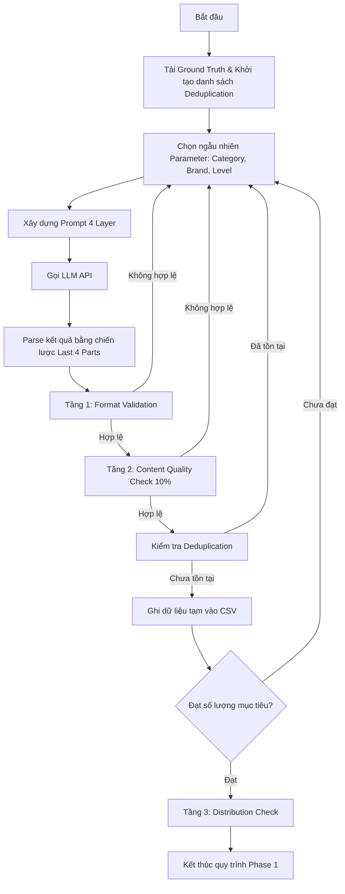

# CHƯƠNG 3. XÂY DỰNG VÀ PHÂN TÍCH BỘ DỮ LIỆU

Chương này trình bày chi tiết về quy trình xây dựng bộ dữ liệu phát hiện tin nhắn lừa đảo tiếng Việt (ViSmishDS). Quy trình bao gồm: thu thập và gán nhãn tập dữ liệu thực (ground truth), thiết kế pipeline tạo sinh dữ liệu vòng đầu bằng các Mô hình Ngôn ngữ Lớn (LLM), thực hiện các biện pháp cải biên kỹ thuật để nâng cao chất lượng và kiểm soát hiện tượng rò rỉ dữ liệu, quy trình gán nhãn siêu dữ liệu mở rộng (Metadata Schema v2), và phân tích các đặc trưng phân phối tĩnh của bộ dữ liệu tổng thể.

---

## 3.1. Quy trình thu thập và gán nhãn dữ liệu thực (Ground Truth)

Bộ dữ liệu thực tế (real data) đóng vai trò nền tảng, phản ánh chính xác nhất phân phối của các tin nhắn SMS trong thế giới thực tại Việt Nam.

### 3.1.1. Thu thập thủ công từ các nguồn công khai
Dữ liệu tin nhắn hợp lệ (Label 0) và lừa đảo (Label 1) được thu thập từ các nguồn công khai sau:
- **Cổng thông tin phòng chống lừa đảo quốc gia** (chuyentrang.safety.ais.gov.vn, chongthurac.vn): Thu thập các mẫu tin nhắn độc hại đã được người dùng báo cáo và được Cục An toàn thông tin xác minh.
- **Các diễn đàn, hội nhóm bảo mật trên mạng xã hội** (Facebook, Telegram): Thu thập ảnh chụp màn hình tin nhắn smishing từ cộng đồng, sau đó tiến hành số hóa nội dung bằng công cụ OCR và kiểm tra lại bằng tay để đảm bảo độ chính xác.

### 3.1.2. Thu thập dữ liệu thực tế thông qua thiết bị di động
Nhóm nghiên cứu tiến hành trích xuất tin nhắn SMS trực tiếp từ thiết bị di động cá nhân của các thành viên và tình nguyện viên là sinh viên ngành CNTT thuộc Trường Đại học Công nghệ Thông tin (UIT), trong độ tuổi 21-22; dữ liệu tin nhắn được chốt vào tháng 11/2025. Luồng dữ liệu này chủ yếu cung cấp các tin nhắn hợp lệ bao gồm: thông báo mã OTP từ ngân hàng/dịch vụ trực tuyến, tin nhắn chăm sóc khách hàng (SMS Brandname) của các nhà mạng, tin nhắn quảng cáo và tin nhắn trao đổi cá nhân.

### 3.1.3. Quy trình gán nhãn dữ liệu thực
Sau khi hoàn tất quá trình thu thập, làm sạch và chuẩn hóa dữ liệu, nhóm nghiên cứu tiến hành gán nhãn cho bộ dữ liệu thực theo phương pháp gán nhãn cộng tác dựa trên đồng thuận nhóm (*collaborative annotation with consensus-based decision*). 

Bộ dữ liệu được gán nhãn theo bài toán phân loại nhị phân, trong đó mỗi tin nhắn được gán vào một trong hai lớp: tin nhắn không lừa đảo (nhãn 0) và tin nhắn lừa đảo (nhãn 1). 

Khác với quy trình gán nhãn nhiều người độc lập thường được sử dụng trong các bộ dữ liệu lớn, nhóm nghiên cứu không thực hiện pha gán nhãn thử, không chia dữ liệu cho từng người gán độc lập và không tính các chỉ số đồng thuận như Cohen’s Kappa hoặc Fleiss’ Kappa. Thay vào đó, toàn bộ quá trình gán nhãn được thực hiện thông qua các phiên họp nhóm gồm 5 người, đều là các sinh viên thuộc ngành CNTT theo học tại UIT. Trong mỗi phiên gán nhãn, một thành viên đại diện trình chiếu lần lượt từng mẫu tin nhắn, trong khi các thành viên còn lại cùng quan sát, thảo luận và đưa ra nhận định. Nhãn cuối cùng của mỗi mẫu được xác định sau khi cả nhóm thống nhất, sau đó được thành viên đại diện ghi nhận vào bộ dữ liệu.

Cách tiếp cận này được lựa chọn dựa trên một số đặc điểm thực tế của bộ dữ liệu và bài toán nghiên cứu:
- **Thứ nhất**, quy mô bộ dữ liệu thực tế sau khi hợp nhất chỉ gồm 2.567 bản ghi duy nhất, cho phép nhóm có thể cùng rà soát từng mẫu trong các phiên gán nhãn tập trung.
- **Thứ hai**, bài toán trong phạm vi khoá luận là phân loại nhị phân, không phải phân loại đa lớp với nhiều ranh giới nhãn phức tạp. Do đó, đối với phần lớn mẫu dữ liệu, việc xác định tin nhắn có mang dấu hiệu lừa đảo hay không có thể được thực hiện tương đối rõ ràng khi đối chiếu với ngữ cảnh và các dấu hiệu nhận biết đã thống nhất.
- **Thứ ba**, nhóm đã nhận thức trước tình trạng mất cân bằng nhãn nghiêm trọng trong dữ liệu thực, đặc biệt là số lượng tin nhắn lừa đảo thực tế thu thập được rất hạn chế. Sau quá trình gán nhãn, bộ dữ liệu chỉ có **246 mẫu** thuộc lớp lừa đảo và **2.321 mẫu** thuộc lớp không lừa đảo, cho thấy việc rà soát cẩn thận từng mẫu là cần thiết nhằm hạn chế bỏ sót các trường hợp dương tính.

Trong quá trình gán nhãn, nhóm sử dụng các tiêu chí nhận diện tin nhắn lừa đảo dựa trên nội dung, mục đích giao tiếp và các dấu hiệu hành vi thường gặp. Một tin nhắn được xem là lừa đảo nếu nội dung có mục đích dụ dỗ, thao túng hoặc đánh lừa người nhận thực hiện một hành động có nguy cơ gây hại, chẳng hạn như truy cập liên kết không đáng tin cậy, phát sinh vấn đề liên quan tới tài khoản ngân hàng, cung cấp thông tin cá nhân, chuyển tiền, liên hệ với số điện thoại lạ, tải ứng dụng không rõ nguồn gốc hoặc làm theo hướng dẫn giả mạo tổ chức uy tín. Ngược lại, các tin nhắn không thể hiện mục đích lừa đảo rõ ràng, bao gồm tin nhắn cá nhân thông thường, tin nhắn OTP hợp lệ, thông báo dịch vụ, quảng cáo hoặc chăm sóc khách hàng không chứa dấu hiệu giả mạo, được gán vào lớp không lừa đảo.

Đối với các trường hợp mơ hồ, nhóm không đưa ra quyết định dựa trên một dấu hiệu đơn lẻ mà xem xét tổng hợp nhiều yếu tố, bao gồm ngữ cảnh nội dung, người gửi, cách diễn đạt, sự xuất hiện của đường dẫn hoặc số điện thoại, mức độ khẩn cấp trong thông điệp, yêu cầu cung cấp thông tin nhạy cảm và khả năng giả mạo một tổ chức đáng tin cậy. Các mẫu gây tranh luận được thảo luận trực tiếp trong nhóm cho đến khi đạt được sự thống nhất về nhãn cuối cùng. Trong trường hợp nội dung không đủ bằng chứng để kết luận là lừa đảo, nhóm ưu tiên gán nhãn theo hướng thận trọng nhằm tránh mở rộng quá mức định nghĩa của lớp lừa đảo.

Quy trình gán nhãn cộng tác này giúp tận dụng nhận định của nhiều thành viên trong nhóm, đặc biệt đối với các mẫu có yếu tố ngôn ngữ bất thường, viết tắt, thiếu dấu, chứa ký tự đặc biệt hoặc có dấu hiệu né tránh bộ lọc. Việc cùng xem xét từng mẫu cũng giúp giảm nguy cơ sai lệch do nhận định cá nhân và đảm bảo các quyết định nhãn được áp dụng nhất quán trong toàn bộ bộ dữ liệu.

Tuy nhiên, quy trình này cũng có những hạn chế cần được thừa nhận. Do các thành viên không gán nhãn độc lập trên cùng một tập mẫu, khoá luận không thể báo cáo các độ đo định lượng về mức độ đồng thuận giữa những người gán nhãn như Cohen’s Kappa hoặc Fleiss’ Kappa. Ngoài ra, hình thức thảo luận nhóm có thể chịu ảnh hưởng bởi sự đồng thuận xã hội hoặc ý kiến của thành viên có lập luận nổi trội hơn. Vì vậy, bộ dữ liệu trong khoá luận nên được hiểu là bộ dữ liệu đã được thẩm định theo cơ chế đồng thuận nhóm, thay vì một bộ dữ liệu được gán nhãn độc lập và đánh giá đồng thuận theo quy trình gán nhãn tiêu chuẩn.

---

## 3.2. Quy trình xây dựng dữ liệu tạo sinh vòng đầu (Phase 1)

Nhằm bù đắp sự khan hiếm nghiêm trọng của dữ liệu smishing thực tế và chuẩn bị một tập dữ liệu huấn luyện phong phú cho các mô hình học máy, nghiên cứu thiết lập một quy trình tạo sinh dữ liệu có kiểm soát sử dụng các Mô hình Ngôn ngữ Lớn (LLM). Quy trình này được xây dựng trên nền tảng kết hợp các hệ phân tầng thuộc tính (taxonomy) và kỹ thuật thiết kế prompt nghiêm ngặt để tối ưu hóa chất lượng dữ liệu.

### 3.2.1. Nền tảng xây dựng dữ liệu tạo sinh và Hệ phân tầng (Taxonomy)

Để dữ liệu tạo sinh không bị chung chung hay quá xa rời thực tế, nghiên cứu thiết lập hai hệ phân lớp (taxonomy) song song đóng vai trò là các **tham số điều khiển ngữ cảnh trong prompt tạo sinh**, thay vì là thuộc tính siêu dữ liệu tĩnh cuối cùng của tập dữ liệu:

1.  **Hệ phân tầng mức độ trang trọng (Formality Taxonomy) cho Nhãn 0 (Tin nhắn hợp lệ)**:
    Mô tả cấu trúc tin nhắn hợp lệ qua 5 mức độ trang trọng từ Level 0 đến Level 4:
    *   **Level 0 (Cứng hoàn toàn)**: Template cố định có entropy thông tin thấp, sử dụng bởi các tổ chức lớn (ngân hàng, nhà mạng) phục vụ mã OTP hoặc biến động số dư, dễ dàng phân tích bằng biểu thức chính quy (regex).
    *   **Level 1 (Mềm)**: Template có cấu trúc cố định nhưng chứa các trường dữ liệu động biến đổi cao như thông báo giao hàng (logistics) hay cập nhật trạng thái đơn hàng (e-commerce).
    *   **Level 2 (Bán trang trọng)**: Tin nhắn giao dịch từ các doanh nghiệp vừa và nhỏ (SMEs), đôi khi chứa lỗi viết tắt hoặc bỏ dấu một phần do thói quen soạn thảo.
    *   **Level 3 (Thân thiện)**: Tin nhắn chăm sóc khách hàng từ các cơ sở dịch vụ nhỏ (phòng khám tư, cửa hàng thời trang) với giọng văn gần gũi.
    *   **Level 4 (Cá nhân hoàn toàn)**: Tin nhắn trao đổi không chính thống giữa các cá nhân (P2P), sử dụng ngôn ngữ tự nhiên, viết tắt, không dấu hoặc tiếng lóng. Cần phân biệt rõ: hiện tượng bỏ dấu ở Level 4 là đặc trưng phong cách tự nhiên, hoàn toàn khác biệt với hành vi che giấu chữ viết (obfuscation) có chủ đích của tin nhắn lừa đảo.
    
    *Ánh xạ điều khiển*: Các danh mục tin nhắn hợp lệ được gán các mức formal tương ứng. Ví dụ, ngân hàng và viễn thông được giới hạn trong Level 0–1, trong khi tin nhắn cá nhân và OTP có thể trải rộng từ Level 0 đến Level 4.

2.  **Hệ phân tầng mức độ che giấu chữ viết (Obfuscation Taxonomy) cho Nhãn 1 (Tin nhắn lừa đảo)**:
    Xây dựng thang đo độ nghiêm trọng gồm 6 bậc liên tục (từ Level 0 đến Level 5) đại diện cho các chiến thuật ngụy trang văn bản nhằm trốn tránh các bộ lọc từ khóa của nhà mạng:
    *   **Level 0 (Không che giấu)**: Tin nhắn smishing viết chuẩn chỉnh, trang trọng tương tự tin nhắn thật của tổ chức để tạo lòng tin tối đa (dạng tin nhắn này đặc biệt nguy hiểm và khó phân biệt nếu chỉ dựa trên đặc trưng bề mặt).
    *   **Level 1 (Leet nhẹ)**: Thay thế 1–2 ký tự nguyên âm bằng số có hình dạng tương đồng (ví dụ: `ng@n h@ng`, `li3n k3t`).
    *   **Level 2 (Leet nặng)**: Viết chệch ký tự ở hầu hết các từ nhạy cảm và kết hợp loại bỏ dấu thanh để phá vỡ đặc trưng từ vựng (thường xuất hiện trong kịch bản giả mạo BHXH, trợ cấp).
    *   **Level 3 (Chèn ký tự ngăn cách)**: Chèn dấu chấm, dấu phẩy hoặc dấu gạch dưới giữa từng chữ cái của các từ khóa nhạy cảm (ví dụ: `K.h.ó.a_t.à.i_k.h.o.ả.n`, `N_ạ_p_t_i_ề_n`) nhằm phá vỡ cơ chế tách từ (tokenization) của mô hình phân loại.
    *   **Level 4 (Trộn ký tự đặc biệt)**: Trộn lẫn ký tự Unicode lạ, ký tự đồng hình (homoglyphs) hoặc biểu tượng toán học để biểu diễn từ ngữ nhạy cảm.
    *   **Level 5 (Gây nhiễu cực đoan)**: Văn bản bị xáo trộn cấu trúc nặng nề, kết hợp sai lệch dấu thanh Unicode (Unicode diacritics) phức tạp, gây cản trở lớn đối với con người khi đọc trực tiếp nhưng vẫn truyền tải được ý đồ lừa đảo cơ bản.
    
    *Ánh xạ điều khiển*: Các kịch bản smishing được ghép cặp với các mức độ che giấu phù hợp trong thực tế. Ví dụ, kịch bản đòi nợ/đe dọa thường ở Level 0–1, giả mạo ngân hàng ở Level 1–2, và các nội dung nhạy cảm/quảng cáo đen thường xuất hiện ở Level 3–5.

**Cơ chế điều khiển không gian xác suất của LLM**:
LLM không ghi nhớ trực tiếp dữ liệu huấn luyện mà tạo văn bản bằng cách dự đoán token tiếp theo từ không gian phân phối xác suất. Việc thiết kế prompt tốt đóng vai trò thu hẹp không gian tìm kiếm của mô hình, đảm bảo tính nhất quán của định dạng đầu ra mà không làm triệt tiêu tính đa dạng (diversity) của nội dung. Trong quy trình này, tham số `temperature` được điều chỉnh linh hoạt: giữ ở mức thấp ($0.2 - 0.4$) cho các nhóm dữ liệu formal (Level 0, 1) để bảo toàn cấu trúc template, và tăng lên mức cao ($0.7 - 0.9$) cho các nhóm tin nhắn có độ nhiễu cao (obfuscation Level 4, Level 5) nhằm khuyến khích mô hình sinh ra các biến thể ký tự phi chuẩn phong phú.

**Ba tiêu chí chất lượng cốt lõi của dữ liệu tổng hợp**:
*   **Fidelity (Độ trung thực)**: Nội dung sinh ra phải mô phỏng chính xác văn phong, cấu trúc câu, cách phân bổ liên kết (URL) và tên thương hiệu của SMS thực tế tại Việt Nam, tránh tạo ra ranh giới quyết định ảo (artificial boundary) khiến mô hình học sai lệch.
*   **Diversity (Đa dạng)**: Phủ đều các kịch bản, mức độ trong hệ phân tầng. Đối với Nhãn 0, sự đa dạng được đo bằng tổ hợp: $\text{sender\_type} \times \text{category} \times \text{formal\_level}$. Đối với Nhãn 1, sự đa dạng được quyết định bởi: $\text{category} \times \text{psychology (chiến thuật tâm lý)} \times \text{obfuscation\_level}$.
*   **Novelty (Tính mới)**: Các mẫu sinh ra không được trùng lặp ngữ nghĩa với tập dữ liệu thực ground truth hoặc lặp lại lẫn nhau trong cùng một batch.

**Sự vượt trội của Few-Shot so với Zero-Shot**:
Thực nghiệm sơ bộ cho thấy chế độ sinh zero-shot (chỉ cung cấp mô tả nhiệm vụ) khiến mô hình dễ gặp hiện tượng ảo giác (hallucination): sinh tin nhắn Nhãn 0 bằng tiếng Anh hoặc tiếng Việt dịch máy thô sơ, không đúng định dạng của ngân hàng Việt Nam; đồng thời sinh tin nhắn Nhãn 1 quá "sạch", thiếu hoàn toàn các biến thể viết tắt và kỹ thuật che giấu chữ viết. Ngược lại, kỹ thuật few-shot cung cấp từ 3–5 ví dụ mẫu cụ thể của từng kịch bản tin nhắn thật tương ứng giúp LLM nhanh chóng học văn phong, cấu trúc viết tắt đặc trưng, cách sử dụng các liên kết giả mạo, các chiến thuật tâm lý và các mức độ obfuscate thích hợp.

**Giải quyết các thách thức đặc thù**:
*   *Thách thức đối với Nhãn 0*: LLM có xu hướng tự động hiệu chỉnh văn bản về dạng chuẩn ngữ pháp. Để mô phỏng đúng tin nhắn Level 2 và 3 chứa lỗi viết tắt tự nhiên của các cửa hàng/doanh nghiệp nhỏ, prompt few-shot cần cung cấp các ví dụ chứa lỗi thực tế để mô hình không tự động "sửa sai", hạn chế lỗi nhận nhầm (False Positive) sau này. Ngoài ra, mô hình cần học cách phân biệt sự khẩn cấp hợp lệ (ví dụ: OTP hết hạn sau 5 phút) với sự khẩn cấp đe dọa (ví dụ: khóa tài khoản trong 2 giờ).
*   *Thách thức đối với Nhãn 1*: Các bộ lọc an toàn mặc định (safety filters) của LLM thương mại thường từ chối sinh nội dung lừa đảo. Để giải quyết rào cản này, chúng tôi áp dụng kỹ thuật **safety framing** trong prompt để thiết lập bối cảnh nghiên cứu học thuật hợp pháp.

### 3.2.2. Kiến trúc Prompt 4 Layer thiết kế nghiêm ngặt

Hệ thống prompt tạo sinh được thiết kế theo cấu trúc phân tầng gồm 4 lớp (layer) độc lập nhằm đáp ứng các nguyên lý kỹ thuật prompt hiện đại (White et al., 2023 [21]; Brown et al., 2020 [20]; Long et al., 2022 [22]):

*   **Layer 1 - Persona & Task Framing (Chỉ dẫn vai trò và Bối cảnh)**:
    Thiết lập vai trò chuyên môn sâu cho LLM để định hình phân phối từ vựng đầu ra. 
    *   *Với Nhãn 0*: Thiết lập vai trò chuyên gia phân tích dữ liệu viễn thông xây dựng bộ dữ liệu SMS hợp lệ tại Việt Nam.
    *   *Với Nhãn 1 (Safety Framing)*: Định hình mô hình là "Chuyên gia an ninh mạng đang xây dựng tập dữ liệu mô phỏng smishing phục vụ mục đích nghiên cứu phòng chống lừa đảo trực tuyến". Bối cảnh này giúp mô hình vượt qua bộ lọc an toàn nhưng vẫn tập trung vào việc tạo ra các kịch bản lừa đảo thực tế.
*   **Layer 2 - Task Specification (Định nghĩa Nhiệm vụ & Kỹ thuật Biến - Hằng)**:
    Áp dụng nguyên lý *conditional prompting* để phân tách các tham số đầu vào:
    *   *Các Hằng số*: Định dạng đầu ra nghiêm ngặt (chuỗi thô phân tách bằng ký tự đường ống `|`), cấu trúc các trường thông tin cố định trong kết quả trả về.
    *   *Các Biến số*: Các tham số thay đổi theo từng batch để tạo sự đa dạng, bao gồm: danh mục kịch bản (`category`), danh sách tên thương hiệu (`brands`), mức độ trang trọng hoặc mức độ che giấu chữ viết (`formal_level`/`obfuscation_level`), và số lượng mẫu cần sinh (`batch_size`). Danh sách các `brands` được truyền vào dạng một mảng để mô hình tự lựa chọn ngẫu nhiên cho từng dòng, tránh hiện tượng toàn bộ một batch chỉ lặp lại một tên thương hiệu cố định.
*   **Layer 3 - Few-Shot Demonstrations (Thư viện ví dụ Few-shot)**:
    Cung cấp từ 3–5 ví dụ thực tế (lấy từ tập ground truth thực) tương ứng với từng danh mục dưới định dạng phân tách bằng dấu gạch đứng (`|`). Các ví dụ được lựa chọn dựa trên nguyên lý **Coverage Matrix** (Ma trận bao phủ) để đảm bảo mô hình tiếp xúc đồng thời với các tổ hợp đa dạng của loại người gửi ($\text{sender\_type}$), chiến thuật thuyết phục và mức độ che giấu chữ viết. Mô hình học từ cách viết tắt, cấu trúc viết lách phi tiêu chuẩn, và cách cài cắm link độc hại từ các ví dụ này. Định dạng `|` được chọn thay vì dấu phẩy (CSV) truyền thống vì tin nhắn SMS tiếng Việt thường chứa dấu phẩy tự nhiên; việc dùng CSV dễ gây lỗi phân tích cú pháp (parsing error) khi LLM quên đóng mở ngoặc kép theo chuẩn RFC 4180.
*   **Layer 4 - Negative Instructions (Chỉ dẫn loại trừ/Ràng buộc tiêu cực)**:
    Đưa ra danh sách các hành vi bị cấm để khắc phục triệt để các lỗi hệ thống của LLM:
    *   *Với Nhãn 1*: Không tạo dòng tiêu đề hoặc markdown block phụ, không sử dụng dấu nháy đơn trong trường `sender_type` để tránh lỗi parse cơ sở dữ liệu, không lặp lại cùng một tên miền (domain) giả mạo trong một batch, không sử dụng tên thương hiệu thật trong đường link độc hại (phải dùng domain giả lập có dạng như `vcb-digibank.xyz`).
    *   *Với Nhãn 0*: Chỉ sử dụng các liên kết thật (.vn, .com.vn), không đưa các từ ngữ thúc giục đe dọa vào nội dung, không sử dụng bất kỳ hình thức che giấu chữ viết nào, đặc biệt **không sử dụng các chuỗi giữ chỗ (placeholders)** như `[TÊN]`, `[SỐ ĐIỆN THOẠI]`, `XXXXXX` để tránh làm nhiễu dữ liệu huấn luyện.

### 3.2.3. Pipeline sinh dữ liệu và Đánh giá chất lượng 3 tầng

Quy trình tạo sinh dữ liệu được vận hành tự động thông qua API của các mô hình ngôn ngữ lớn (chủ đạo là Gemini 1.5 Flash). Quy trình hoạt động theo mô hình lặp (loop):

**Chiến lược Parse "Last 4 Parts"**:
Khi LLM trả về chuỗi văn bản, hệ thống thực hiện tách chuỗi dựa trên ký tự phân tách `|`. Do nội dung tin nhắn SMS có thể vô tình chứa ký tự `|` do mô hình tự sinh, hệ thống áp dụng kỹ thuật lấy 4 phần tử cuối cùng làm các trường siêu dữ liệu tương ứng (`label`, `has_url`, `has_phone`, `sender_type`), và ghép toàn bộ các phần tử phía trước lại làm trường nội dung `content`. Giải pháp này đảm bảo độ bền vững của parser tự động.

**Quy trình đánh giá chất lượng 3 tầng (3-Tier Quality Validation)**:
Để đảm bảo dữ liệu sinh ra đạt chuẩn học máy, mỗi batch dữ liệu phải vượt qua ba tầng kiểm duyệt nghiêm ngặt:
1.  **Tầng 1: Format Validation (Tự động)**:
    Hệ thống kiểm tra tự động xem mẫu dữ liệu có đủ 5 trường thông tin hay không; kiểm tra kiểu dữ liệu của các trường nhị phân (`has_url`, `has_phone`); xác định trường `sender_type` phải nằm trong tập xác định (`brandname`, Shortcode, `personal_number`, `not_applicable`); giới hạn độ dài tin nhắn từ 20 đến 600 ký tự; và đối chiếu tính nhất quán logic (ví dụ: nếu `has_url` bằng 1 thì trong `content` bắt buộc phải chứa chuỗi định dạng URL). Với Nhãn 0, bổ sung kiểm tra loại trừ sự xuất hiện của các domain giả mạo hoặc ký tự placeholder literal.
2.  **Tầng 2: Content Quality Check (Thủ công)**:
    Nhóm nghiên cứu thực hiện rà soát thủ công ngẫu nhiên **10% số mẫu** của mỗi batch. Quá trình kiểm tra tập trung vào việc đánh giá tính thực tế của kịch bản, độ tự nhiên của câu văn tiếng Việt, sự phù hợp của văn phong so với mức độ che giấu/trang trọng yêu cầu trong prompt, và kiểm tra xem có xuất hiện các mẫu lỗi lặp template quá mức hay không.
3.  **Tầng 3: Distribution Check (Đánh giá phân phối mục tiêu)**:
    Sau khi gom đủ số lượng mẫu, hệ thống đánh giá phân phối tổng thể của các siêu dữ liệu so với phân phối mục tiêu đã thiết lập dựa trên thực tế:
    *   *Nhãn 1*: Định hướng đạt tỷ lệ khoảng ~50% `personal_number` và ~75% `has_url`.
    *   *Nhãn 0*: Định hướng đạt tỷ lệ khoảng ~70% `brandname` và ~40% `has_url`.

**Kết quả vòng đầu tiên (Phase 1)**:
Trải qua quy trình lọc và kiểm định 3 tầng, vòng tạo sinh đầu tiên thu được **4.970 mẫu tạo sinh Nhãn 1** và **3.000 mẫu tạo sinh Nhãn 0** đảm bảo đúng định dạng cấu trúc kỹ thuật và sẵn sàng đưa vào các bước cải biên chất lượng tiếp theo.

---

## 3.3. Cải thiện chất lượng dữ liệu tạo sinh và đánh giá định lượng

Sau khi thu được dữ liệu vòng đầu, nhóm nghiên cứu phát hiện các "artifact" tạo sinh điển hình: dữ liệu tạo sinh nhãn 0 quá trang trọng (formal), dữ liệu tạo sinh nhãn 1 quá lạm dụng kỹ thuật viết chệch ký tự (leet/obfuscation) một cách không thực tế, tạo ra các lối tắt (shortcuts) khiến mô hình học máy dễ dàng phân loại dựa trên đặc trưng bề mặt thay vì hiểu sâu ngữ nghĩa. Do đó, một quy trình cải biên chất lượng dữ liệu được triển khai.

### 3.3.1. Các biện pháp xử lý và làm sạch đã áp dụng

#### A. Giảm thiểu hiện tượng "Over-Obfuscation" ở Nhãn 1
Trong dữ liệu tạo sinh nhãn 1 ban đầu, có đến 53% số mẫu thuộc mức độ che giấu nặng (Level 2), nơi hầu như mọi từ nhạy cảm đều bị leet (ví dụ: `kh0ng`, `t13n`, `n4p`). Để sửa chữa, nhóm sử dụng Gemini 1.5 Flash để chuẩn hóa chính tả cho các từ context/glue không nhạy cảm (như chuyển `kh0ng` về `không`, `v4o` về `vào`), chỉ giữ lại leet ở các từ mang tính lừa đảo chính (như tài khoản, nạp tiền, bảo mật). Quy trình đã hiệu chỉnh thành công **2.261 mẫu** từ Level 2 về Level 0 (văn phong tự nhiên không che giấu).

| Mức độ che giấu (Obfuscation level) | Số lượng mẫu trước chỉnh sửa | Số lượng mẫu sau chỉnh sửa |
| :--- | :---: | :---: |
| **Level 0** (Không che giấu) | 638 | 2.899 |
| **Level 1** (Leet nhẹ) | 651 | 651 |
| **Level 2** (Leet nặng) | 2.647 | 386 |
| **Level 3** (Chèn dấu cách) | 670 | 670 |
| **Level 4** (Ký tự đặc biệt) | 225 | 225 |
| **Level 5** (Nhiễu cực đoan) | 139 | 139 |
| **Tổng cộng** | **4.970** | **4.970** |

*Bảng 3.1: Phân phối mức độ che giấu của Nhãn 1 trước và sau hiệu chỉnh.*

#### B. Thay thế dữ liệu tạo sinh Nhãn 0 bằng dữ liệu P2P từ ViLexNorm
Tin nhắn hợp lệ tạo sinh thường thiếu văn phong đời thường. Nhóm tiến hành thay thế **1.001 mẫu** nhãn 0 tạo sinh bằng dữ liệu hội thoại thực tế được lọc từ bộ dữ liệu **ViLexNorm** (Facebook, TikTok). Tiêu chuẩn lọc bao gồm: độ dài 10-200 ký tự, không chứa hotline/URL chưa xác minh, không chứa các từ thúc giục (CTA) độc hại, không văng tục. Trong đó, có **501 mẫu** là boundary samples (chứa các cuộc hội thoại đời thường bàn luận về chủ đề tiền bạc, link, tuyển dụng nhưng hoàn toàn lành mạnh).

#### C. Bổ sung Boundary Samples cho Nhãn 1
Để tăng độ khó cho ranh giới quyết định, nhóm tạo thêm **653 mẫu** boundary samples nhãn 1. Đây là những tin nhắn lừa đảo có cấu trúc formal tương tự tin nhắn ngân hàng thật (obfuscation level 0), không sử dụng từ ngữ kích động mạnh và sử dụng kịch bản hội thoại P2P để mô phỏng các trường hợp lừa đảo nhắm vào cá nhân.

#### D. Paraphrase nâng cao tính đa dạng bằng Mistral AI
Nhằm giảm thiểu việc lặp lại các template câu do LLM sinh ra, toàn bộ dữ liệu tạo sinh nhãn 1 (trừ boundary samples) được đưa qua pipeline paraphrase sử dụng Mistral AI với prompt 3 tầng:
1.  *Layer 1 (Role)*: Định hình vai trò chuyên gia phân tích tin nhắn lừa đảo.
2.  *Layer 2 (Rules)*: Đưa ra các quy tắc paraphrase chi tiết theo 8 danh mục nội dung để đa dạng hóa chủ thể, tên thương hiệu, cấu trúc câu.
3.  *Layer 3 (Output Format)*: Chỉ trả về nội dung tin nhắn mới, không kèm giải thích.

### 3.3.2. Đánh giá định lượng hiệu quả của các biện pháp cải thiện

Để chứng minh các biện pháp cải biên thực sự có ích và nâng cao chất lượng dữ liệu, nhóm tiến hành đo đạc các chỉ số định lượng trước và sau khi cải thiện.

#### a) Đa dạng dữ liệu ngữ nghĩa và mức độ lặp mẫu
Sử dụng mô hình embedding để tính độ tương đồng cosine nearest-neighbor (NN similarity) của các mẫu trong tập dữ liệu tạo sinh nhãn 1 nhằm kiểm tra mức độ trùng lặp thông tin ngữ nghĩa:

| Chỉ số tương đồng trên dữ liệu tạo sinh Nhãn 1 | Trước cải thiện | Sau cải thiện |
| :--- | :---: | :---: |
| Mean embedding NN similarity | 0.9533 | 0.9273 |
| Median embedding NN similarity | 0.9621 | 0.9288 |
| Tỷ lệ mẫu có NN similarity $\ge 0.90$ | 92.73% | 76.68% |
| Tỷ lệ mẫu có NN similarity $\ge 0.95$ | 63.17% | 27.48% |

*Bảng 3.2: So sánh mức độ tương đồng nearest-neighbor trước và sau cải thiện.*

Độ tương đồng nearest-neighbor giảm mạnh sau cải thiện, đặc biệt tỷ lệ các mẫu trùng lặp cao ($\ge 0.95$) giảm từ 63.17% xuống còn 27.48%. Điều này chứng tỏ Mistral Paraphrase đã phân tán phân phối ngữ nghĩa, giúp dữ liệu đa dạng hơn.

Đồng thời, mức độ lặp lại các cụm từ cố định được đo bằng tỷ lệ trùng lặp N-gram trên toàn bộ văn bản:

| Lát cắt dữ liệu | Chỉ số N-gram | Trước cải thiện | Sau cải thiện |
| :--- | :---: | :---: | :---: |
| Dữ liệu tạo sinh Nhãn 1 | 5-gram | 0.6008 | 0.4873 |
| | 6-gram | 0.5202 | 0.3951 |
| Dữ liệu tạo sinh Nhãn 0 | 5-gram | 0.5188 | 0.4712 |
| | 6-gram | 0.4321 | 0.3867 |

*Bảng 3.3: So sánh mức độ lặp N-gram của dữ liệu tạo sinh.*

Tỷ lệ lặp cụm từ cố định (N-gram) giảm đáng kể ở cả hai nhãn, xác nhận việc giảm thiểu các template câu sáo rỗng của LLM gốc.

#### b) Giảm thiểu "Artifact" và trạng thái quá mức Obfuscation
Việc đánh giá mức độ che giấu chữ viết (leet words) sau quy trình chuẩn hóa chính tả cho thấy leet được kiểm soát chặt chẽ:

| Chỉ số đo leet trên dữ liệu tạo sinh Nhãn 1 | Trước cải thiện | Sau cải thiện |
| :--- | :---: | :---: |
| Tỷ lệ tin nhắn có chứa leet | 82.45% | 72.78% |
| Tỷ lệ token bị leet hóa trên tổng số token | 18.87% | 4.91% |
| Mật độ leet trung bình trên mỗi tin nhắn | 0.2700 | 0.0671 |

*Bảng 3.4: So sánh các chỉ số đặc trưng leet trước và sau cải thiện.*

Leet token rate giảm mạnh từ 18.87% xuống còn 4.91%, đưa phân phối leet trong dữ liệu tạo sinh về mức thực tế, buộc mô hình phải học các đặc trưng ngữ nghĩa sâu thay vì chỉ phát hiện các ký tự biến dạng bề mặt.

#### c) Cân bằng phân phối độ dài văn bản
Độ dài tin nhắn tạo sinh ban đầu ngắn hơn nhiều so với tin nhắn lừa đảo thực tế. Sau cải thiện, độ dài đã được kéo về gần phân phối thực tế:

| Chỉ số độ dài (ký tự) | Trước cải thiện | Sau cải thiện | Dữ liệu thực tế |
| :--- | :---: | :---: | :---: |
| Độ dài trung bình | 117.48 | 159.83 | 194.09 |
| Trung vị độ dài | 110.00 | 149.00 | 156.00 |
| Phân vị P90 | 182.00 | 238.00 | 321.00 |

*Bảng 3.5: So sánh phân phối độ dài tin nhắn.*

Việc tăng độ dài trung bình từ 117.48 lên 159.83 ký tự giúp thu hẹp khoảng cách phân phối (domain gap) giữa dữ liệu nhân tạo và dữ liệu thực tế.

---

## 3.4. Quy trình mở rộng bộ siêu dữ liệu (Metadata Schema v2)

Để phục vụ cho các thực nghiệm đánh giá lát cắt chi tiết ở Chương 5, bộ dữ liệu ViSmishDS được gắn nhãn lại toàn bộ các thuộc tính siêu dữ liệu theo lược đồ **Metadata Schema v2.1.0-locked**.

### 3.4.1. Lược đồ Metadata Schema v2
Lược đồ v2 mở rộng từ 5 thuộc tính cơ bản ban đầu lên 11 thuộc tính đa chiều:
-   `message_domain` (Chủ đề chính): Phân loại tin nhắn thành các miền trung lập (như banking_finance, public_service, telecom, commerce, logistics, marketing_promotion, employment, investment, debt_collection, gambling, adult_service, personal_social).
-   `sender_type` (Loại đầu số người gửi): brandname, shortcode, personal_number, not_applicable.
-   `text_phenomena` (Hiện tượng văn bản): abbreviation, teencode, diacritic_omission, character_substitution, punctuation_insertion, v.v.
-   `text_noise_score` (Mức phi chuẩn): Thang điểm từ 0 đến 4 thể hiện độ khó đọc của tin nhắn do lỗi chính tả hoặc cách viết phi chuẩn.
-   `target_audience` (Đối tượng nhắm đến): nhóm tuổi, giới tính, vai trò xã hội của nạn nhân (khách hàng, người tìm việc, con nợ) đi kèm bằng chứng cụ thể (evidence span).
-   `obfuscation` (Che giấu chủ ý): present (có/không), techniques (kỹ thuật cụ thể), severity (mức độ từ 0 đến 4).
-   `persuasion_tactics` (Chiến thuật thuyết phục): impersonation (giả mạo), urgency (cấp bách), fear (sợ hãi), reward_incentive (lợi ích), v.v.
-   `requested_actions` (Hành động yêu cầu): click_or_visit_link, call_phone, reply_message, provide_personal_information, transfer_money, install_application.

### 3.4.2. Quy trình thử nghiệm Pilot và tối ưu hóa Prompt
Để đảm bảo chất lượng và tính nhất quán khi gán nhãn tự động quy mô lớn bằng LLM, quy trình được thực hiện qua 3 giai đoạn:

1.  **Giai đoạn 1 (Pilot Evaluation)**: Chọn ngẫu nhiên 100 mẫu tin nhắn đại diện cho tất cả các nguồn dữ liệu. Tiến hành chạy gán nhãn tự động bằng prompt v2 ban đầu qua API. Một nhóm thành viên tiến hành đọc chéo thủ công để đối chiếu kết quả gán nhãn của mô hình với ground truth tự nhiên.
2.  **Giai đoạn 2 (Tối ưu hóa và Chốt Prompt)**: Phân tích lỗi từ tập pilot cho thấy mô hình dễ nhầm lẫn giữa hiện tượng viết phi chuẩn thông thường (`text_noise_score`) với hành vi cố tình che giấu chữ viết nhằm né bộ lọc (`obfuscation.severity`). Prompt được viết lại để phân định rõ ranh giới hai khái niệm, bổ sung các ví dụ few-shot chi tiết, và thắt chặt cấu trúc JSON đầu ra để tránh lỗi định dạng.
3.  **Giai đoạn 3 (Gán nhãn đồng loạt)**: Chạy prompt tối ưu đã chốt trên toàn bộ dữ liệu tạo sinh còn lại. Các thuộc tính gán nhãn tự động này đóng vai trò là nhãn metadata tĩnh hỗ trợ cho quá trình phân tích lỗi và phân tích lát cắt.

---

## 3.5. Phân tích thống kê đặc trưng của bộ dữ liệu tổng thể (ViSmishDS)

Sau toàn bộ quy trình thu thập, gán nhãn, cải biên và mở rộng siêu dữ liệu, bộ dữ liệu ViSmishDS chính thức được hình thành.

### 3.5.1. Thành phần cấu trúc bộ dữ liệu
Bộ dữ liệu tổng thể bao gồm **10.562 mẫu**, được phân bổ chi tiết theo nguồn dữ liệu (data_origin):

-   **Dữ liệu thực tế (Real Data)**: 2.567 mẫu (bao gồm 2.321 mẫu nhãn 0 và 246 mẫu nhãn 1).
-   **Dữ liệu tạo sinh bằng LLM (Synthetic Data)**:
    -   `synthetic`: 2.008 mẫu (bao gồm 1.998 mẫu nhãn 0 và 10 mẫu nhãn 1).
    -   `paraphrased`: 4.333 mẫu nhãn 1 được paraphrase lại để đa dạng hóa cách diễn đạt.
    -   `synthetic_hard_positive`: 653 mẫu nhãn 1 boundary samples có văn phong nghiêm túc tương tự tin nhắn thật.
-   **Dữ liệu chéo miền (External Data)**:
    -   `external_real` (thuộc ViLexNorm): 500 mẫu hội thoại P2P thực tế trên mạng xã hội.
    -   `external_curated` (thuộc ViLexNorm): 501 mẫu hội thoại P2P được chọn lọc kỹ có chứa các từ khóa nhạy cảm nhưng lành mạnh.

| data_origin | Nhãn 0 (Legitimate) | Nhãn 1 (Smishing) | Tổng cộng | Tỷ lệ (%) |
| :--- | :---: | :---: | :---: | :---: |
| real | 2.321 | 246 | 2.567 | 24.3% |
| external_real (ViLexNorm) | 500 | 0 | 500 | 4.7% |
| external_curated (ViLexNorm) | 501 | 0 | 501 | 4.7% |
| paraphrased | 0 | 4.333 | 4.333 | 41.0% |
| synthetic | 1.998 | 10 | 2.008 | 19.0% |
| synthetic_hard_positive | 0 | 653 | 653 | 6.2% |
| **Tổng cộng** | **5.320** | **5.242** | **10.562** | **100%** |

*Bảng 3.6: Phân phối mẫu theo nguồn gốc dữ liệu và nhãn.*

### 3.5.2. Phân phối đặc trưng siêu dữ liệu (Metadata)

#### A. Siêu dữ liệu Sender Type (Loại người gửi)
Sự phân phối loại người gửi cho thấy sự khác biệt rõ rệt giữa hai lớp nhãn:

| sender_type | Nhãn 0 (Legitimate) | Nhãn 1 (Smishing) | Tổng cộng |
| :--- | :---: | :---: | :---: |
| brandname | 1.450 | 65 | 1.515 |
| personal_number | 290 | 185 | 475 |
| shortcode | 687 | 30 | 717 |
| not_applicable (synthetic) | 2.893 | 3.962 | 6.855 |

*Bảng 3.7: Phân phối sender_type trong bộ dữ liệu.*

Trong dữ liệu thực tế, phần lớn tin nhắn hợp lệ (Label 0) đến từ các đầu số `brandname` hoặc `shortcode` của dịch vụ viễn thông/ngân hàng. Ngược lại, tin nhắn lừa đảo thực tế (Label 1) chủ yếu xuất phát từ `personal_number` (đầu số rác cá nhân), ngoại trừ một số trường hợp giả mạo thương hiệu tinh vi qua trạm BTS giả vẫn hiển thị `brandname`.

#### B. Đặc trưng has_url và has_phone_number
Các chỉ báo bề mặt như liên kết tên miền (URL) và số điện thoại liên lạc thường xuất hiện nhiều hơn trong tin nhắn lừa đảo:

-   **has_url**: Tin nhắn lừa đảo chứa URL với tỷ lệ **67%** — gấp hơn 2,4 lần so với tin nhắn hợp lệ ham (chỉ chiếm **28%**). Đây là đặc trưng phân biệt mạnh nhất trong nhóm đặc trưng bề mặt, với hệ số tương quan Pearson đạt 0.39. Kẻ tấn công lạm dụng URL hoặc URL rút gọn để dẫn dụ nạn nhân vào các liên kết giả mạo nhằm chiếm đoạt tài khoản.
-   **has_phone_number**: Số điện thoại xuất hiện ở cả hai nhóm với tỷ lệ tương đương — chênh lệch chỉ **3 điểm phần trăm** giữa hai nhóm và hệ số tương quan Pearson rất thấp (chỉ đạt 0.04). Siêu dữ liệu này có giá trị phân biệt thấp khi đứng độc lập, nhưng có thể hữu ích khi kết hợp với các đặc trưng khác (ví dụ: người gửi là số cá nhân rác và nội dung yêu cầu gọi lại hotline).

### 3.5.3. Phân phối danh mục kịch bản Smishing (Category)
Phân phối 8 danh mục nội dung lừa đảo của lớp Label 1 sau quy trình gán nhãn siêu dữ liệu mở rộng:

| Danh mục kịch bản (Category) | Số lượng mẫu | Tỷ lệ (%) |
| :--- | :---: | :---: |
| Nội dung nhạy cảm (quảng cáo người lớn, dịch vụ đen) | 722 | 16.88% |
| Cờ bạc / Betting | 721 | 16.86% |
| Crypto / Đầu tư giả | 720 | 16.84% |
| BHXH / Trợ cấp giả mạo | 681 | 15.93% |
| Tuyển dụng giả (việc nhẹ lương cao) | 676 | 15.81% |
| Dịch vụ công giả mạo (phạt nguội, định danh vneid) | 549 | 12.84% |
| Đòi nợ / Đe dọa | 477 | 11.16% |
| Giả mạo ngân hàng (khóa thẻ, lỗi hệ thống) | 454 | 10.62% |

*Bảng 3.8: Phân phối các kịch bản lừa đảo nhãn 1.*

Sự phân bổ đồng đều giữa các danh mục giúp mô hình học máy được tiếp xúc rộng rãi với nhiều kịch bản tấn công khác nhau, hạn chế tình trạng thiên lệch về một vài kịch bản phổ biến như giả mạo ngân hàng hay tuyển dụng.

### 3.5.4. Đặc trưng mức độ che giấu văn bản (Obfuscation Level)
Phân phối mức độ che giấu chữ viết của toàn bộ tập dữ liệu lừa đảo Nhãn 1 sau cải biên:
-   **Level 0 (Không che giấu)**: 1.029 mẫu (24.06%) - tin nhắn lừa đảo có cấu trúc chuẩn chỉnh, formal.
-   **Level 1 (Leet nhẹ)**: 785 mẫu (18.36%) - thay đổi 1-2 ký tự nhạy cảm để lách bộ lọc của nhà mạng.
-   **Level 2 (Leet nặng)**: 520 mẫu (12.16%) - viết chệch chữ viết ở nhiều từ nhạy cảm kết hợp không dấu.
-   **Level 3 (Chèn dấu ngăn cách)**: 890 mẫu (20.81%) - chèn các dấu chấm, dấu gạch ngang (như `N.ạ.p t.i.ề.n`, `K.h.ó.a_t.à.i_k.h.o.ả.n`).
-   **Level 4 (Trộn ký tự đặc biệt)**: 652 mẫu (15.25%) - chèn các ký tự Unicode lạ hoặc homoglyph để ngụy trang.
-   **Level 5 (Gây nhiễu cực đoan)**: 400 mẫu (9.35%) - văn bản bị xáo trộn nặng nề, khó đọc đối với con người.

Phân phối đa cấp độ che giấu này là nền tảng để thực hiện các phân tích lát cắt chi tiết ở Chương 5, nhằm kiểm chứng xem mô hình học sâu hay mô hình ngôn ngữ lớn nhạy cảm hơn trước các chiến thuật ngụy trang chữ viết của tin tặc.
