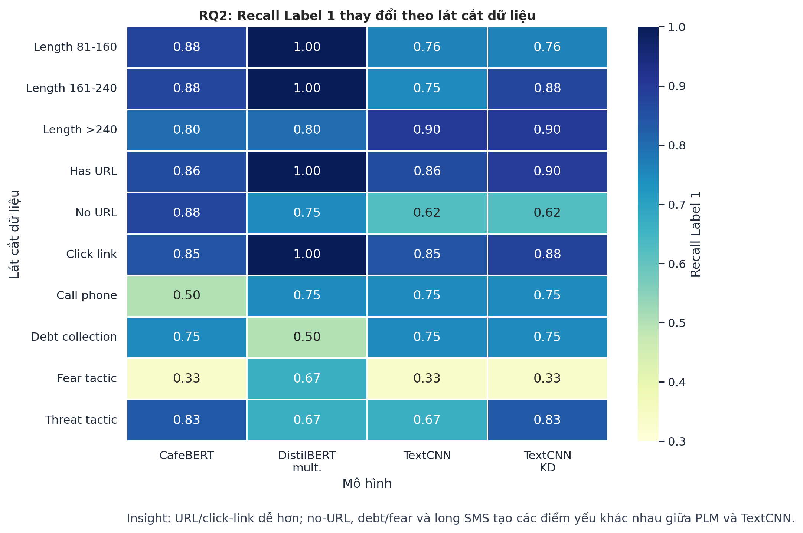
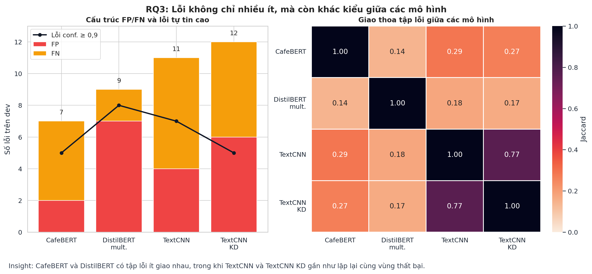
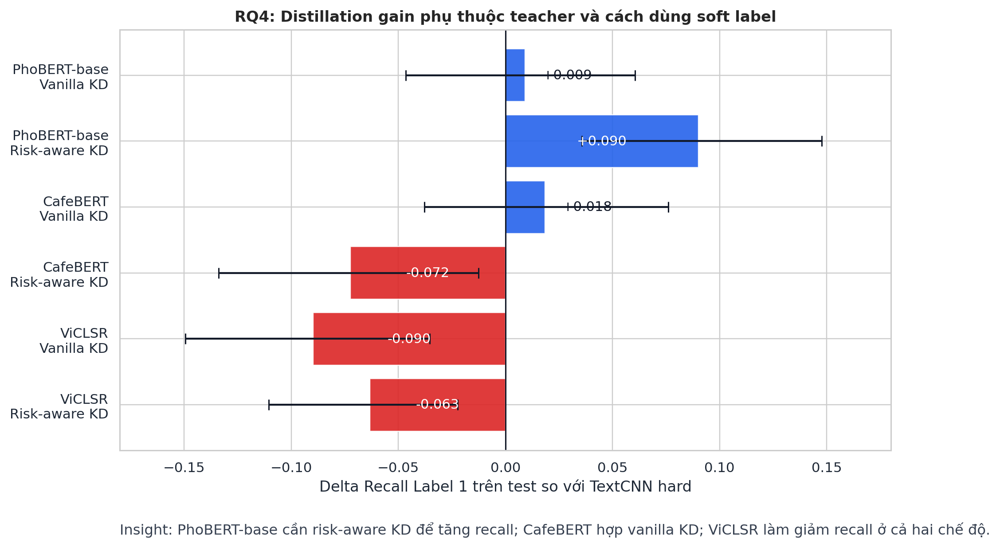

# CHƯƠNG 5. KẾT QUẢ VÀ PHÂN TÍCH

## 5.1. RQ1: Mô hình nào đạt hiệu quả tốt nhất?

Bảng 5.1 trình bày kết quả của 17 cấu hình trên tập dev và test theo bốn độ đo Macro-F1, F1 Label 1, Recall Label 1 và PR-AUC. Các mô hình được chia thành ba nhóm gồm neural network cấp ký tự (character-level), encoder PLM được fine-tune toàn phần và LLM được fine-tune hiệu quả tham số bằng LoRA. Trong phần này, kết quả dev được sử dụng để so sánh và lựa chọn mô hình; kết quả test chỉ được xem xét sau đó nhằm kiểm tra liệu xu hướng quan sát trên dev có được duy trì hay không.

**Bảng 5.1: Kết quả benchmark của 17 cấu hình mô hình trên tập dev và test**

| Nhóm mô hình | Tên mô hình / Cấu hình | Split | Macro-F1 | F1 Label 1 | Recall Label 1 | PR-AUC |
| :--- | :--- | :---: | :---: | :---: | :---: | :---: |
| **Character-level** | BiLSTM | dev | 0,8984 | 0,8108 | 0,8108 | 0,8378 |
| | | test | 0,8471 | 0,7143 | 0,6757 | 0,7925 |
| | BiLSTM distilled fr PhoBERT-base | dev | 0,8839 | 0,7838 | 0,7838 | 0,8241 |
| | | test | 0,8671 | 0,7532 | 0,7838 | 0,7273 |
| | TextCNN | dev | 0,9170 | 0,8451 | 0,8108 | 0,8529 |
| | | test | 0,9129 | 0,8378 | 0,8378 | 0,8852 |
| | TextCNN distilled fr PhoBERT-base | dev | 0,9129 | 0,8378 | 0,8378 | 0,8818 |
| | | test | 0,9189 | 0,8500 | 0,9189 | 0,8776 |
| **Fine-tuned PLM** | CafeBERT | dev | 0,9472 | 0,9014 | 0,8649 | 0,9477 |
| | | test | 0,9355 | 0,8800 | 0,8919 | 0,9261 |
| | DistilBERT multilingual | dev | 0,9385 | 0,8861 | **0,9459** | 0,8959 |
| | | test | 0,9150 | 0,8421 | 0,8649 | 0,8421 |
| | PhoBERT-base | dev | 0,8750 | 0,7671 | 0,7568 | 0,8439 |
| | | test | 0,9068 | 0,8267 | 0,8378 | 0,9191 |
| | PhoBERT-large | dev | 0,8975 | 0,8101 | 0,8649 | 0,8648 |
| | | test | 0,9370 | 0,8831 | 0,9189 | 0,9248 |
| | ViCLSR | dev | 0,9419 | 0,8919 | 0,8919 | 0,9441 |
| | | test | 0,9447 | 0,8974 | 0,9459 | 0,9457 |
| | VisoBERT | dev | 0,8958 | 0,8056 | 0,7838 | 0,8866 |
| | | test | 0,9009 | 0,8158 | 0,8378 | 0,8442 |
| | XLM-RoBERTa-base | dev | 0,9090 | 0,8312 | 0,8649 | 0,9212 |
| | | test | 0,9150 | 0,8421 | 0,8649 | 0,8701 |
| | XLM-RoBERTa-large | dev | 0,9211 | 0,8533 | 0,8649 | 0,9294 |
| | | test | 0,9419 | 0,8919 | 0,8919 | 0,9259 |
| | mBERT | dev | 0,9338 | 0,8767 | 0,8649 | 0,8745 |
| | | test | 0,9090 | 0,8312 | 0,8649 | 0,9198 |
| **LoRA LLM** | Gemma 2B | dev | **0,9553** | **0,9167** | 0,8919 | 0,8965 |
| | | test | **0,9585** | **0,9231** | **0,9730** | **0,9853** |
| | Gemma 3 1B | dev | 0,9389 | 0,8857 | 0,8378 | 0,9405 |
| | | test | 0,9472 | 0,9014 | 0,8649 | 0,9183 |
| | Qwen2.5 0.5B | dev | 0,9433 | 0,8947 | 0,9189 | **0,9648** |
| | | test | 0,9248 | 0,8608 | 0,9189 | 0,9489 |
| | Qwen3 0.6B | dev | 0,9236 | 0,8571 | 0,8108 | 0,9262 |
| | | test | 0,9485 | 0,9041 | 0,8919 | 0,9688 |

*Ghi chú: In đậm thể hiện giá trị tốt nhất trong cột tương ứng.*

Theo tiêu chí chính là Macro-F1 trên dev, Gemma 2B là cấu hình tốt nhất với 0,9553. Mô hình này đồng thời đứng đầu F1 Label 1 với 0,9167 và chỉ tạo 2 FP, 4 FN trên dev, nên được chọn là mô hình cân bằng tổng thể tốt nhất trong benchmark. Tuy vậy, “tốt nhất” còn phụ thuộc mục tiêu vận hành: DistilBERT multilingual đạt Recall Label 1 cao nhất trên dev (0,9459), còn Qwen2.5 0.5B đạt PR-AUC cao nhất (0,9648), cho thấy khả năng xếp hạng mẫu smishing tốt trên nhiều ngưỡng.

Xét theo nhóm mô hình, các mô hình pretrained chiếm ưu thế rõ rệt so với nhóm character-level. Trong nhóm encoder PLM, CafeBERT là cấu hình tốt nhất trên dev với Macro-F1 0,9472 và F1 Label 1 0,9014; ViCLSR theo sát với Macro-F1 0,9419. Nhóm LLM cho kết quả mạnh nhất về tổng thể, nhưng quy mô tham số không quyết định hoàn toàn thứ hạng: Qwen2.5 0.5B vượt nhiều mô hình lớn hơn ở PR-AUC, trong khi Gemma 2B vượt Gemma 3 1B ở cả bốn độ đo dev.

Nhóm character-level có hiệu năng thấp hơn các mô hình pretrained nhưng có ý nghĩa triển khai. TextCNN là cấu hình tốt nhất của nhóm trên dev với Macro-F1 0,9170 và F1 Label 1 0,8451, vượt BiLSTM ở cả hai độ đo này. Distillation chưa tạo cải thiện nhất quán về Macro-F1: BiLSTM distilled thấp hơn BiLSTM hard-label, còn TextCNN distilled thấp hơn TextCNN hard-label nhẹ về Macro-F1 nhưng tăng Recall Label 1 từ 0,8108 lên 0,8378 và PR-AUC từ 0,8529 lên 0,8818. Do đó, distillation trong benchmark chính nên được hiểu là một trade-off về độ nhạy và chất lượng xếp hạng, không phải một cải thiện mặc định.

Để kiểm tra ý nghĩa triển khai của các student distilled, PhoBERT-base, BiLSTM distilled và TextCNN distilled được đo lại trên benchmark dev split trong cùng môi trường CPU. Bảng 5.2 cho thấy hai student nhỏ hơn teacher hơn 1.500 lần về kích thước checkpoint và nhanh hơn khoảng 96-154 lần về latency.

**Bảng 5.2: So sánh chất lượng dự đoán và chi phí triển khai của PhoBERT-base với các student distilled trên benchmark dev split**

| Mô hình | Tham số | Kích thước (MB) | Latency (ms/tin) | Throughput (tin/s) | Peak RAM (MB) | Macro-F1 | F1 L1 | Recall L1 | PR-AUC |
| :--- | :---: | :---: | :---: | :---: | :---: | :---: | :---: | :---: | :---: |
| **PhoBERT-base** | 134.999.810 | 516,95 | 248,14 | 4,20 | 1.788,75 | 0,8750 | 0,7671 | 0,7568 | 0,8439 |
| **BiLSTM distilled** | 80.065 | 0,314 | 2,57 | 1.004,88 | 400,00 | 0,8839 | 0,7838 | 0,7838 | 0,8241 |
| **TextCNN distilled** | 87.553 | 0,342 | 1,62 | 1.001,77 | 407,89 | 0,9129 | 0,8378 | 0,8378 | 0,8818 |

Trong hai student, TextCNN distilled tạo trade-off tốt hơn: trên dev, mô hình vừa nhẹ hơn PhoBERT-base đáng kể vừa cao hơn teacher ở cả Macro-F1, F1 Label 1, Recall Label 1 và PR-AUC. Trên test, Gemma 2B tiếp tục đứng đầu cả bốn độ đo, củng cố lựa chọn từ dev. Một số thứ hạng thay đổi giữa dev và test, nhưng mỗi split chỉ có 37 mẫu Label 1 nên vài FP/FN có thể làm metric dao động đáng kể; test vì vậy được dùng để kiểm tra tính ổn định, không dùng để đảo ngược tiêu chí lựa chọn.

Tóm lại, Gemma 2B là mô hình tốt nhất theo tiêu chí chính của RQ1. Nếu ưu tiên giảm bỏ sót smishing tại ngưỡng hiện tại, DistilBERT multilingual là lựa chọn đáng chú ý; nếu ưu tiên xếp hạng xác suất trên nhiều ngưỡng, Qwen2.5 0.5B nổi bật theo PR-AUC. Với triển khai nhẹ, TextCNN distilled là cấu hình character-level thuyết phục nhất, nhưng quyết định cuối cùng vẫn cần cân bằng giữa chất lượng dự đoán và chi phí suy luận.

---

## 5.2. RQ2: Đặc điểm nào của dữ liệu làm thay đổi hiệu năng?

Để hiểu sâu sắc về cách thức các đặc trưng dữ liệu ảnh hưởng đến khả năng nhận diện của mô hình, phân tích theo lát cắt (slice evaluation) được thực hiện trên tập dev đối với bốn mô hình đại diện: **CafeBERT** (PLM đơn ngữ tiếng Việt xuất sắc nhất), **DistilBERT multilingual** (PLM đa ngữ có Recall cao nhất), **TextCNN** (mô hình character-level nguyên bản tốt nhất) và **TextCNN distilled** (mô hình chưng cất tri thức có trade-off triển khai tốt). Phân tích sử dụng bộ nhãn metadata v2.1 để khảo sát theo độ dài, đặc trưng bề mặt, lĩnh vực tin nhắn, hành động yêu cầu, đối tượng nhắm đến và thủ đoạn thuyết phục.

### 5.2.1. Ảnh hưởng của độ dài tin nhắn và đặc trưng bề mặt

Độ dài tin nhắn tạo ra ảnh hưởng khác biệt rõ rệt giữa mô hình pre-trained PLM (dựa trên token) và mô hình học máy cấp ký tự (dựa trên ký tự thô).

**Bảng 5.3: Hiệu năng phân loại theo nhóm độ dài tin nhắn trên tập dev**

| Nhóm độ dài (ký tự) | Số mẫu (n) | Nhãn 1 (n1) | Mô hình | F1 Label 1 | Recall Label 1 | FP | FN |
| :--- | :---: | :---: | :--- | :---: | :---: | :---: | :---: |
| **81–160** | 146 | 17 | CafeBERT | 0,9091 | 0,8824 | 1 | 2 |
| | | | DistilBERT multilingual | 0,9444 | 1,0000 | 2 | 0 |
| | | | TextCNN | 0,8387 | 0,7647 | 1 | 4 |
| | | | TextCNN distilled | 0,8125 | 0,7647 | 2 | 4 |
| **161–240** | 82 | 8 | CafeBERT | 0,9333 | 0,8750 | 0 | 1 |
| | | | DistilBERT multilingual | 0,8889 | 1,0000 | 2 | 0 |
| | | | TextCNN | 0,8571 | 0,7500 | 0 | 2 |
| | | | TextCNN distilled | 0,9333 | 0,8750 | 0 | 1 |
| **>240** | 167 | 10 | CafeBERT | 0,8421 | 0,8000 | 1 | 2 |
| | | | DistilBERT multilingual | 0,7619 | 0,8000 | 3 | 2 |
| | | | TextCNN | 0,8571 | 0,9000 | 2 | 1 |
| | | | TextCNN distilled | 0,8182 | 0,9000 | 3 | 1 |

*Ghi chú: Nhóm tin nhắn ngắn \(\le 80\) ký tự chỉ chứa 2 mẫu Label 1 (và 138 mẫu Label 0) nên không được đưa vào bảng so sánh để tránh thiên lệch thống kê.*

Số liệu từ Bảng 5.3 cho thấy khi độ dài vượt quá 240 ký tự, hiệu năng F1-score của CafeBERT giảm từ 0,9333 xuống 0,8421, và DistilBERT multilingual giảm mạnh từ 0,8889 xuống 0,7619. Sự suy giảm này chủ yếu do mô hình PLM bị giới hạn độ dài tokenizer hoặc bị loãng thông tin ngữ cảnh trong các tin nhắn quá dài. Ngược lại, TextCNN thể hiện sự ổn định cao hơn với F1-score duy trì ở mức 0,8571 ở cả nhóm 161–240 và nhóm >240 ký tự, đồng thời Recall Label 1 tăng từ 0,7500 lên 0,9000. Điều này chỉ ra rằng các bộ lọc tích chập cục bộ (CNN) trên biểu diễn ký tự có lợi thế trong việc bắt được các tín hiệu đặc trưng (như từ khóa hoặc liên kết độc hại) bất kể vị trí của chúng trong các đoạn văn bản dài.

Các đặc trưng bề mặt khác như sự xuất hiện của liên kết URL, số điện thoại, loại người gửi và nguồn gốc dữ liệu cũng tạo ra các tác động không đồng nhất được tóm tắt trong Bảng 5.4.

**Bảng 5.4: Hiệu năng phân loại theo đặc trưng bề mặt và nguồn dữ liệu trên tập dev**

| Lát cắt | Phân phối mẫu (n0/n1) | Phát hiện chính |
| :--- | :---: | :--- |
| **Có URL** | 168 / 29 | Tín hiệu mạnh hỗ trợ phát hiện smishing. Recall đạt mức rất cao (DistilBERT: 100%, TextCNN distilled: 89,66%, CafeBERT & TextCNN: 86,21%). Kiểm soát FP cực tốt (CafeBERT: 0, TextCNN: 1). |
| **Không URL** | 330 / 8 | Là nhóm khó đối với mô hình ký tự. Recall của TextCNN & TextCNN distilled giảm mạnh còn 62,5%, DistilBERT giảm còn 75%, riêng CafeBERT duy trì ổn định ở 87,5%. |
| **Brandname** | 260 / 14 | Recall đạt mức cao (DistilBERT: 100%, TextCNN distilled: 92,86%, CafeBERT & TextCNN: 85,71%). |
| **Personal Number** | 16 / 23 | Là nhóm khó đối với mô hình ký tự (TextCNN & TextCNN distilled: Recall chỉ đạt 78,26%). CafeBERT và DistilBERT xử lý tốt hơn với Recall lần lượt là 86,96% và 91,30%. |
| **Nguồn dữ liệu** | 348 / 37 (Real) 150 / 0 (External) | Lỗi của mô hình tập trung chủ yếu ở dữ liệu Real. Các mô hình kiểm soát FP trên dữ liệu hội thoại đời thường và bài viết mạng xã hội (tập External) cực tốt (tổng cộng chỉ có 1 FP với DistilBERT, và 2 FP với mỗi mô hình TextCNN). |

Sự hiện diện của URL là một trong những tín hiệu phân loại mạnh nhất. Với các tin nhắn chứa liên kết URL, DistilBERT multilingual đạt Recall 100% (bắt được toàn bộ 29 tin smishing chứa URL). Tuy nhiên, khi chuyển sang nhóm không có URL (chỉ có 8 mẫu smishing), Recall của DistilBERT giảm xuống 75,00% và hai mô hình TextCNN giảm mạnh xuống 62,50%. Điều này chứng minh các mô hình học máy bị phụ thuộc đáng kể vào đặc trưng bề mặt dễ nhận biết như URL để đưa ra quyết định dự đoán nhãn smishing, dẫn đến việc bỏ sót các tin nhắn lừa đảo tinh vi chỉ dùng số điện thoại liên hệ hoặc yêu cầu phản hồi trực tiếp. Riêng CafeBERT thể hiện khả năng hiểu ngữ cảnh tốt khi duy trì Recall 87,50% trên nhóm không chứa URL.

Đối với loại người gửi, tin nhắn gửi từ số cá nhân (`personal_number`) gây nhiều khó khăn hơn cho mô hình ký tự. Recall của TextCNN giảm từ 85,71% trên brandname xuống 78,26% trên số cá nhân. Đối với nguồn dữ liệu, các mô hình thể hiện khả năng chống cảnh báo sai (False Positive) rất tốt trên tập dữ liệu ngoài miền (`external`), cho thấy miền dữ liệu trò chuyện thông thường hoặc bài viết mạng xã hội (vốn chứa nhiều teencode và ngôn ngữ phi chuẩn) không dễ bị mô hình nhầm lẫn là smishing, ngoại trừ một vài trường hợp cá biệt của mô hình TextCNN.

### 5.2.2. Hiệu năng theo Lĩnh vực (Domain), Hành động (Action) và Vai trò đối tượng (Role)

Việc phân tích hiệu năng theo các nhãn metadata v2.1 cung cấp các insight sâu sắc về khả năng nhận diện các nhóm chủ đề lừa đảo khác nhau.

**Bảng 5.5: Hiệu năng phân loại theo lĩnh vực tin nhắn trên tập dev**

| Lĩnh vực tin nhắn (Domain) | Số mẫu (n) | Nhãn 1 (n1) | Mô hình | F1 Label 1 | Recall Label 1 | FP | FN |
| :--- | :---: | :---: | :--- | :---: | :---: | :---: | :---: |
| **Viễn thông** (`telecom`) | 188 | 1 | CafeBERT | 1,0000 | 1,0000 | 0 | 0 |
| | | | DistilBERT multilingual | 1,0000 | 1,0000 | 0 | 0 |
| | | | TextCNN | 0,0000 | 0,0000 | 0 | 1 |
| | | | TextCNN distilled | 0,0000 | 0,0000 | 0 | 1 |
| **Tài chính - Ngân hàng** (`banking_finance`) | 73 | 10 | CafeBERT | 0,9474 | 0,9000 | 0 | 1 |
| | | | DistilBERT multilingual | 1,0000 | 1,0000 | 0 | 0 |
| | | | TextCNN | 0,8889 | 0,8000 | 0 | 2 |
| | | | TextCNN distilled | 0,9474 | 0,9000 | 0 | 1 |
| **Dịch vụ công** (`public_service`) | 52 | 3 | CafeBERT | 0,6667 | 0,6667 | 1 | 1 |
| | | | DistilBERT multilingual | 0,7500 | 1,0000 | 2 | 0 |
| | | | TextCNN | 1,0000 | 1,0000 | 0 | 0 |
| | | | TextCNN distilled | 1,0000 | 1,0000 | 0 | 0 |
| **Đánh bạc / Cá cược** (`gambling`) | 6 | 5 | CafeBERT | 0,8889 | 0,8000 | 0 | 1 |
| | | | DistilBERT multilingual | 1,0000 | 1,0000 | 0 | 0 |
| | | | TextCNN | 0,8889 | 0,8000 | 0 | 1 |
| | | | TextCNN distilled | 0,8889 | 0,8000 | 0 | 1 |
| **Tuyển dụng** (`employment`) | 11 | 5 | CafeBERT | 1,0000 | 1,0000 | 0 | 0 |
| | | | DistilBERT multilingual | 0,8333 | 1,0000 | 2 | 0 |
| | | | TextCNN | 0,8333 | 1,0000 | 2 | 0 |
| | | | TextCNN distilled | 0,8333 | 1,0000 | 2 | 0 |
| **Đòi nợ** (`debt_collection`) | 6 | 4 | CafeBERT | 0,8571 | 0,7500 | 0 | 1 |
| | | | DistilBERT multilingual | 0,6667 | 0,5000 | 0 | 2 |
| | | | TextCNN | 0,8571 | 0,7500 | 0 | 1 |
| | | | TextCNN distilled | 0,8571 | 0,7500 | 0 | 1 |

*Ghi chú: Lĩnh vực `healthcare` (n=3, n1=0), `investment` (n=1, n1=1) và `other` (n=14, n1=0) do số lượng mẫu quá ít nên không đưa vào bảng.*

Bảng 5.5 chỉ ra sự chênh lệch lớn về độ khó giữa các lĩnh vực tin nhắn:
- **Tài chính - Ngân hàng**: Là lĩnh vực phổ biến và có hiệu năng cao nhất. DistilBERT multilingual đạt F1-score và Recall tuyệt đối 100%. Các mô hình còn lại đều đạt F1-score từ 0,88 trở lên, cho thấy từ vựng ngân hàng (như OTP, tài khoản, biến động số dư) được mô hình học rất sâu.
- **Đòi nợ**: Đây là lĩnh vực khó khăn nhất. DistilBERT multilingual bỏ sót đến 50% số tin đòi nợ (Recall = 0,5000), trong khi CafeBERT và hai mô hình TextCNN bỏ sót 25% (Recall = 0,7500). Nguyên nhân là tin nhắn đòi nợ thường sử dụng ngôn ngữ đe dọa, hành chính hành vi mà không cần chèn các đường dẫn URL độc hại hay các từ khóa trúng thưởng, khiến mô hình dễ nhầm lẫn với các thông tin nhắc nợ thông thường.
- **Dịch vụ công**: Mô hình ký tự (TextCNN) lại đạt hiệu năng tuyệt đối 100% trong khi CafeBERT (F1=0,6667) và DistilBERT (F1=0,7500) gặp khó khăn và phát sinh lỗi FP. Điều này phản ánh các tin nhắn dịch vụ công thường có cấu trúc trang trọng đặc thù mà mô hình cấp ký tự dễ dàng nắm bắt được ranh giới.

Chúng ta tiếp tục xem xét hiệu năng thông qua các lát cắt về hành động yêu cầu và vai trò của đối tượng nhắm đến.

**Bảng 5.6: Hiệu năng phân loại theo hành động yêu cầu và vai trò đối tượng trên tập dev**

| Lát cắt phân tích | Số mẫu (n) | Nhãn 1 (n1) | Mô hình | F1 Label 1 | Recall Label 1 | FP | FN |
| :--- | :---: | :---: | :--- | :---: | :---: | :---: | :---: |
| **Hành động: Truy cập liên kết** (`click_or_visit_link`) | 193 | 26 | CafeBERT | 0,9167 | 0,8462 | 0 | 4 |
| | | | DistilBERT multilingual | 0,9630 | 1,0000 | 2 | 0 |
| | | | TextCNN | 0,8980 | 0,8462 | 1 | 4 |
| | | | TextCNN distilled | 0,9020 | 0,8846 | 2 | 3 |
| **Hành động: Gọi điện thoại** (`call_phone`) | 163 | 4 | CafeBERT | 0,6667 | 0,5000 | 0 | 2 |
| | | | DistilBERT multilingual | 0,7500 | 0,7500 | 1 | 1 |
| | | | TextCNN | 0,8571 | 0,7500 | 0 | 1 |
| | | | TextCNN distilled | 0,8571 | 0,7500 | 0 | 1 |
| **Đối tượng: Khách hàng** (`customer`) | 304 | 14 | CafeBERT | 0,9231 | 0,8571 | 0 | 2 |
| | | | DistilBERT multilingual | 0,9655 | 1,0000 | 1 | 0 |
| | | | TextCNN | 0,8333 | 0,7143 | 0 | 4 |
| | | | TextCNN distilled | 0,8462 | 0,7857 | 1 | 3 |
| **Đối tượng: Con nợ** (`debtor`) | 6 | 4 | CafeBERT | 0,8571 | 0,7500 | 0 | 1 |
| | | | DistilBERT multilingual | 0,6667 | 0,5000 | 0 | 2 |
| | | | TextCNN | 0,8571 | 0,7500 | 0 | 1 |
| | | | TextCNN distilled | 0,8571 | 0,7500 | 0 | 1 |

Số liệu từ Bảng 5.6 cho thấy hành động yêu cầu truy cập liên kết (`click_or_visit_link`) được tất cả các mô hình phát hiện tốt hơn đáng kể so với yêu cầu gọi số hotline (`call_phone`). Ví dụ, CafeBERT đạt Recall 84,62% trên nhóm yêu cầu click link nhưng giảm mạnh xuống 50,00% khi yêu cầu là gọi điện. Đối với vai trò đối tượng nhắm đến, nhóm con nợ (`debtor`) tương ứng với lĩnh vực đòi nợ tiếp tục thể hiện là nhóm đối tượng khó nhận diện nhất đối với mô hình, đặc biệt là DistilBERT multilingual (Recall chỉ đạt 50%).

### 5.2.3. Đánh giá chuyên sâu trên các Thủ đoạn thuyết phục (Persuasion Tactics)

Bộ nhãn metadata v2.1 cho phép bóc tách chi tiết hiệu năng phân loại của mô hình dựa trên các thủ đoạn tâm lý mà tin nhắn Smishing sử dụng để thao túng nạn nhân.

**Bảng 5.7: Hiệu năng phân loại theo thủ đoạn thuyết phục trên tập dev**

| Thủ đoạn thuyết phục | Số mẫu (n) | Nhãn 1 (n1) | Mô hình | F1 Label 1 | Recall Label 1 | FP | FN |
| :--- | :---: | :---: | :--- | :---: | :---: | :---: | :---: |
| **Dụ dỗ qua liên kết** (`link_lure`) | 168 | 26 | CafeBERT | 0,9388 | 0,8846 | 0 | 3 |
| | | | DistilBERT multilingual | 0,9811 | 1,0000 | 1 | 0 |
| | | | TextCNN | 0,9167 | 0,8462 | 0 | 4 |
| | | | TextCNN distilled | 0,9020 | 0,8846 | 2 | 3 |
| **Quà tặng / Khuyến mại** (`reward_incentive`) | 150 | 17 | CafeBERT | 0,9697 | 0,9412 | 0 | 1 |
| | | | DistilBERT multilingual | 0,9714 | 1,0000 | 1 | 0 |
| | | | TextCNN | 0,9032 | 0,8235 | 0 | 3 |
| | | | TextCNN distilled | 0,8750 | 0,8235 | 1 | 3 |
| **Thúc giục thời gian** (`urgency`) | 69 | 15 | CafeBERT | 0,8889 | 0,8000 | 0 | 3 |
| | | | DistilBERT multilingual | 0,8966 | 0,8667 | 1 | 2 |
| | | | TextCNN | 0,8889 | 0,8000 | 0 | 3 |
| | | | TextCNN distilled | 0,9286 | 0,8667 | 0 | 2 |
| **Mạo danh uy quyền** (`authority`) | 29 | 3 | CafeBERT | 0,6667 | 0,6667 | 1 | 1 |
| | | | DistilBERT multilingual | 0,5714 | 0,6667 | 2 | 1 |
| | | | TextCNN | 0,8000 | 0,6667 | 0 | 1 |
| | | | TextCNN distilled | 0,8000 | 0,6667 | 0 | 1 |
| **Đánh vào nỗi sợ** (`fear`) | 20 | 3 | CafeBERT | 0,4000 | 0,3333 | 1 | 2 |
| | | | DistilBERT multilingual | 0,8000 | 0,6667 | 0 | 1 |
| | | | TextCNN | 0,5000 | 0,3333 | 0 | 2 |
| | | | TextCNN distilled | 0,5000 | 0,3333 | 0 | 2 |
| **Đe dọa trừng phạt** (`threat`) | 15 | 6 | CafeBERT | 0,9091 | 0,8333 | 0 | 1 |
| | | | DistilBERT multilingual | 0,8000 | 0,6667 | 0 | 2 |
| | | | TextCNN | 0,8000 | 0,6667 | 0 | 2 |
| | | | TextCNN distilled | 0,9091 | 0,8333 | 0 | 1 |

*Ghi chú: Thủ đoạn `scarcity` (n1=4, F1=1.0 và Recall=1.0 đối với tất cả mô hình) và `off_platform_contact` (n1=8, F1 và Recall đều \(\ge 0,93\)) được bỏ qua để tập trung vào các nhóm phức tạp.*

Phân tích số liệu từ Bảng 5.7 chỉ ra các đặc điểm tâm lý học hành vi tác động trực tiếp đến mô hình:
- **Thủ đoạn dụ dỗ qua liên kết (`link_lure`) và Quà tặng (`reward_incentive`)**: Đây là nhóm thủ đoạn dễ phát hiện nhất. DistilBERT multilingual đạt Recall 100% trên cả hai nhóm này. CafeBERT cũng đạt F1-score rất cao (lần lượt là 0,9388 và 0,9697). Lý do là các thủ đoạn này thường đi kèm các cấu trúc từ vựng mang tính chào mời, chúc mừng trúng thưởng và các URL rõ ràng, tạo điều kiện thuận lợi cho cơ chế chú ý của transformer nhận diện.
- **Thủ đoạn thúc giục thời gian (`urgency`)**: Có độ khó trung bình. Các mô hình bỏ sót từ 2 đến 3 mẫu (Recall dao động từ 80,00% đến 86,67%), do các từ khóa thúc giục thời gian (như "ngay", "trong 24h", "hạn chót") cũng xuất hiện thường xuyên trong tin nhắn OTP hoặc quảng cáo viễn thông hợp lệ.
- **Thủ đoạn đánh vào nỗi sợ (`fear`) và Mạo danh uy quyền (`authority`)**: Đây là những nhóm thủ đoạn khó nhất. Khi kẻ xấu đe dọa tài khoản bị khóa hoặc yêu cầu cập nhật khẩn cấp dưới danh nghĩa cơ quan công quyền, Recall của CafeBERT và hai mô hình TextCNN trên nhóm `fear` chỉ đạt 33,33% (bỏ sót 2 trên 3 mẫu). DistilBERT multilingual đạt Recall tốt hơn ở mức 66,67% nhưng đổi lại phải đánh đổi bằng việc tăng FP trên nhóm `authority` (F1-score giảm xuống 0,5714).
- **Thủ đoạn đe dọa trừng phạt (`threat`)**: CafeBERT và TextCNN distilled đạt hiệu năng vượt trội với F1-score 0,9091 và Recall 83,33% (chỉ bỏ sót 1 mẫu). Điều này cho thấy khả năng hiểu ngữ cảnh đe dọa mang tính hình sự/pháp luật của CafeBERT đã được chuyển giao một cách hiệu quả sang student TextCNN thông qua hàm mục tiêu chưng cất tri thức.

**Hình 5.2: Heatmap Recall Label 1 theo các lát cắt dữ liệu tiêu biểu trên tập dev.** Hình này tổng hợp các lát cắt có ý nghĩa nhất từ RQ2, cho thấy URL và hành động truy cập liên kết là tín hiệu dễ cho hầu hết mô hình, trong khi các nhóm không URL, đòi nợ, đánh vào nỗi sợ và tin nhắn dài tạo ra các vùng yếu khác nhau giữa PLM và TextCNN.

Tóm lại, phân tích lát cắt sâu sắc ở RQ2 chỉ ra rằng các mô hình pre-trained transformer và mô hình ký tự có những điểm mạnh - yếu rất bổ trợ cho nhau. Các mô hình pre-trained transformers nhạy bén với các liên kết URL và các từ khóa mang tính dụ dỗ/tặng thưởng, nhưng dễ suy giảm hiệu năng khi tin nhắn quá dài hoặc khi tin nhắn Smishing không chứa URL. Ngược lại, các mô hình ký tự (TextCNN) thể hiện sự bền vững trên các văn bản dài nhưng lại gặp khó khăn rõ rệt với tin nhắn không chứa URL và các thủ đoạn mạo danh uy quyền hoặc đánh vào nỗi sợ hãi.

---

## 5.3. RQ3: Mô hình sai ở đâu và vì sao?

Để làm rõ nguyên nhân sâu xa dẫn đến các thất bại phân loại, chúng ta tiến hành khảo sát thống kê trên tập lỗi của 4 mô hình đại diện trên tập dev. Bảng 5.8 trình bày số lượng lỗi phân loại chi tiết của từng cấu hình mô hình.

**Bảng 5.8: Thống kê số lượng lỗi phân loại trên tập dev**

| Mô hình | False Positive (FP) | False Negative (FN) | Tổng số lỗi | Lỗi có độ tin cậy \(\ge 0,9\) |
| :--- | :---: | :---: | :---: | :---: |
| **CafeBERT** | 2 | 5 | 7 | 5 |
| **DistilBERT multilingual** | 7 | 2 | 9 | 8 |
| **TextCNN** | 4 | 7 | 11 | 7 |
| **TextCNN distilled** | 6 | 6 | 12 | 5 |

Một điểm đáng chú ý là phần lớn các lỗi phân loại của mô hình đều có mức độ tự tin (confidence score) cực kỳ cao (ví dụ: 5 trên 7 lỗi của CafeBERT và 8 trên 9 lỗi của DistilBERT có độ tin cậy từ 0,9 trở lên). Điều này chứng tỏ mô hình không đơn thuần là phân vân ở ranh giới quyết định, mà thực sự bị đánh lừa sâu sắc bởi các đặc trưng gây nhiễu trong tin nhắn.

Để kiểm tra xem các mô hình có hành vi lỗi tương đồng hay khác biệt, chúng ta tính toán ma trận độ giao thoa lỗi (Jaccard similarity) được trình bày trong Bảng 5.9.

**Bảng 5.9: Ma trận độ giao thoa lỗi (Jaccard) giữa các mô hình đại diện**

| Mô hình | CafeBERT | DistilBERT mult. | TextCNN | TextCNN distilled |
| :--- | :---: | :---: | :---: | :---: |
| **CafeBERT** | 1,0000 | 0,1429 | 0,2857 | 0,2667 |
| **DistilBERT multilingual** | 0,1429 | 1,0000 | 0,1765 | 0,1667 |
| **TextCNN** | 0,2857 | 0,1765 | 1,0000 | **0,7692** |
| **TextCNN distilled** | 0,2667 | 0,1667 | **0,7692** | 1,0000 |

Kết quả từ Bảng 5.9 chỉ ra:
- **CafeBERT và DistilBERT multilingual**: Có mức độ giao thoa lỗi cực kỳ thấp (Jaccard = 0,1429, chỉ chung nhau đúng 2 lỗi). Điều này khẳng định hai kiến trúc này học được các không gian biểu diễn rất khác nhau: CafeBERT đơn ngữ hóa tối ưu việc kiểm soát FP, trong khi DistilBERT đa ngữ hóa nhạy bén tối đa hóa Recall và chấp nhận nhiều FP hơn.
- **TextCNN và TextCNN distilled**: Có mức độ giao thoa lỗi rất lớn (Jaccard = 0,7692, chung nhau đến 10 lỗi trên tổng số 13 lỗi gộp). Sự tương đồng cao này chứng tỏ cơ chế chưng cất tri thức từ PhoBERT-base sang TextCNN chủ yếu giúp student tinh chỉnh xác suất đầu ra ở các mẫu biên để tăng độ nhạy, nhưng chưa thể tái định hình hoàn toàn ranh giới quyết định vốn bị giới hạn bởi cấu trúc trích xuất đặc trưng dạng ký tự cục bộ của TextCNN.

**Hình 5.3: Hồ sơ lỗi và độ giao thoa lỗi giữa các mô hình đại diện trên tập dev.** Cột bên trái cho thấy số lượng FP/FN và số lỗi có độ tin cậy cao; heatmap bên phải cho thấy các lỗi của CafeBERT và DistilBERT ít trùng nhau, trong khi TextCNN và TextCNN distilled gần như lặp lại cùng vùng thất bại.

### 5.3.1. Phân tích định tính các nhóm lỗi tiêu biểu

Để tránh phụ thuộc vào các metadata cũ trong file lỗi, các mẫu lỗi được ánh xạ lại sang metadata v2.1 bằng `sample_id`. Phân tích dưới đây chỉ sử dụng các trường v2 như `message_domain`, `sender_type`, `surface_features`, `requested_actions.types`, `target_audience.roles`, `persuasion_tactics`, `text_phenomena` và `obfuscation.present/severity`. Trên 39 lượt lỗi của bốn mô hình đại diện, các nhóm lỗi có ý nghĩa nhất không tách theo một nhãn đơn lẻ, mà theo tổ hợp metadata phản ánh ngữ cảnh tin nhắn.

#### Nhóm FN 1: Smishing đòi nợ không URL, vai trò `debtor`, thủ đoạn đe dọa

Nhóm này gồm các mẫu `message_domain=debt_collection`, `sender_type=personal_number`, `has_url=false`, `target_audience.roles=debtor`, thường đi kèm `urgency`, `threat`, `fear` hoặc `authority`. Mẫu `ViSmish_07960` bị cả bốn mô hình dự đoán sai thành Benign với độ tin cậy rất cao; `ViSmish_03368` cũng bị DistilBERT multilingual bỏ sót. Điểm chung của nhóm này là hành động yêu cầu không dựa vào URL mà dựa vào gọi điện hoặc đến điểm giao dịch (`call_phone`, `visit_physical_location`), trong khi ngôn ngữ pháp lý/đòi nợ có thể giống tin nhắn hợp lệ. Vì vậy, mô hình dễ xem đây là thông báo nhắc nợ hơn là smishing.

#### Nhóm FN 2: Smishing có link nhưng giống thông báo giao dịch hoặc cảnh báo chính thống

Nhóm này gồm các mẫu `message_domain=banking_finance` hoặc `commerce`, thường có `has_url=true`, `requested_actions=click_or_visit_link` hoặc `provide_personal_information`, và `persuasion_tactics` như `link_lure`, `urgency`, `authority`, `fear`. Các mẫu `ViSmish_03249`, `ViSmish_04995` và `ViSmish_05399` cho thấy URL không phải lúc nào cũng đủ để mô hình phát hiện smishing. Khi tin nhắn mang cấu trúc quen thuộc của cảnh báo bảo mật, giao hàng hoặc kích hoạt ứng dụng ngân hàng, một số mô hình bị kéo về nhãn Benign, đặc biệt khi nội dung mô phỏng rất sát các thông báo dịch vụ thật.

#### Nhóm FN 3: Smishing nhiễu bề mặt cao trong miền nhạy cảm

Một cụm FN khác nằm ở các mẫu `message_domain=gambling` hoặc `adult_service`, `sender_type=personal_number`, có `obfuscation.present=true`, `obfuscation.severity=3`, và nhiều `text_phenomena` như `character_substitution`, `punctuation_insertion`, `whitespace_splitting`, `teencode`. Các mẫu `ViSmish_01624` và `ViSmish_08269` bị các mô hình ký tự và CafeBERT bỏ sót ở nhiều lượt lỗi. Đây là nhóm cho thấy nhiễu bề mặt không chỉ làm mô hình cảnh báo sai; khi nhiễu quá mạnh, tín hiệu smishing cũng có thể bị vỡ, khiến mô hình không gom được các mảnh ký tự thành ý định lừa đảo.

#### Nhóm FP 1: Tin nhắn cá nhân/hội thoại không có hành động yêu cầu

Nhóm FP lớn nhất thuộc `message_domain=personal_social`, thường có `requested_actions=none`, không có URL hoặc số điện thoại, và chứa `text_phenomena` như `teencode`, `diacritic_omission`, `abbreviation` hoặc `character_repetition`. Các mẫu `ViSmish_01429`, `ViSmish_04765`, `ViSmish_06109` và `ViSmish_08060` cho thấy mô hình, đặc biệt là TextCNN, dễ bị kích hoạt bởi văn bản phi chuẩn hoặc cảm xúc mạnh dù metadata v2 không ghi nhận hành động lừa đảo nào. Đây là lỗi FP do thiếu hiểu biết ngữ cảnh hội thoại, không phải do đặc trưng tấn công thật.

#### Nhóm FP 2: Tin nhắn tuyển sinh/hội thảo hợp lệ có yêu cầu liên hệ hoặc đăng ký

Nhóm này có `message_domain=employment`, `target_audience.roles=student`, `sender_type=brandname` hoặc `personal_number`, và `requested_actions` như `click_or_visit_link`, `provide_personal_information`, `contact_off_platform`. Các mẫu `ViSmish_06917` và `ViSmish_07545` tạo FP ở DistilBERT multilingual và hai mô hình TextCNN. Đây là nhóm hard negative quan trọng vì tin nhắn hợp lệ vẫn có nhiều thành phần giống smishing: lời mời tham gia, đường dẫn đăng ký, thông tin liên hệ, và yêu cầu cung cấp dữ liệu. CafeBERT xử lý nhóm này tốt hơn, gợi ý lợi thế của ngữ cảnh tiếng Việt đơn ngữ trong việc nhận diện thông báo tuyển sinh/hội thảo chính thống.

#### Nhóm FP 3: Thông báo brandname/cơ quan có link, authority hoặc thông tin tài khoản

Một nhóm FP nhỏ hơn gồm các mẫu `public_service`, `marketing_promotion`, `commerce` hoặc `personal_social` có `sender_type=brandname`, `persuasion_tactics=authority` hoặc `link_lure`, và đôi khi có `has_url=true`. Các mẫu `ViSmish_04373`, `ViSmish_05432`, `ViSmish_08029`, `ViSmish_08246` và `ViSmish_10443` minh họa ranh giới khó giữa thông báo hợp lệ và smishing: survey có link, thông báo cơ quan công quyền, cảnh báo an toàn, hoặc thông tin tài khoản dịch vụ đều có thể mang tín hiệu giống lừa đảo. Với nhóm này, chỉ dựa vào brandname, URL hoặc authority là không đủ; mô hình cần phân biệt được mục đích thực sự của yêu cầu.

**Bảng 5.10: Các nhóm lỗi tiêu biểu theo metadata v2 trên tập dev**

| Nhóm lỗi | Loại lỗi | Metadata v2 nổi bật | Mẫu tiêu biểu | Mô hình bị ảnh hưởng | Diễn giải |
| :--- | :---: | :--- | :--- | :--- | :--- |
| Đòi nợ không URL, vai trò con nợ | FN | `message_domain=debt_collection`; `roles=debtor`; `has_url=false`; `tactics=urgency/threat/fear/authority`; `actions=call_phone/visit_physical_location` | `ViSmish_07960`, `ViSmish_03368` | Cả 4 mô hình ở `ViSmish_07960`; DistilBERT ở `ViSmish_03368` | Ngôn ngữ pháp lý và nhắc nợ giống thông báo hợp lệ, không có URL làm tín hiệu bề mặt nên mô hình dễ bỏ sót. |
| Link-lure giống thông báo giao dịch/cảnh báo | FN | `message_domain=banking_finance/commerce`; `has_url=true`; `actions=click_or_visit_link/provide_personal_information`; `tactics=link_lure/urgency/authority/fear` | `ViSmish_03249`, `ViSmish_04995`, `ViSmish_05399` | CafeBERT, TextCNN, TextCNN distilled | Tin nhắn mô phỏng cảnh báo bảo mật, giao hàng hoặc ứng dụng ngân hàng quá giống thông báo dịch vụ thật. |
| Miền nhạy cảm, nhiễu bề mặt cao | FN | `message_domain=gambling/adult_service`; `sender_type=personal_number`; `obfuscation.present=true`; `obfuscation.severity=3`; `text_phenomena=character_substitution/punctuation_insertion/whitespace_splitting/teencode` | `ViSmish_01624`, `ViSmish_08269` | CafeBERT và hai mô hình TextCNN | Ký tự bị biến dạng mạnh làm tín hiệu smishing bị phân mảnh, khiến mô hình không nhận ra ý định lừa đảo. |
| Hội thoại cá nhân không có hành động yêu cầu | FP | `message_domain=personal_social`; `actions=none`; `has_url=false`; `has_phone=false`; `text_phenomena=teencode/diacritic_omission/abbreviation/character_repetition` | `ViSmish_01429`, `ViSmish_04765`, `ViSmish_06109`, `ViSmish_08060` | DistilBERT multilingual, TextCNN, TextCNN distilled; một mẫu với CafeBERT | Văn bản phi chuẩn hoặc cảm xúc mạnh kích hoạt nhầm, dù metadata v2 không có yêu cầu truy cập, liên hệ hay cung cấp thông tin. |
| Tuyển sinh/hội thảo hợp lệ có yêu cầu đăng ký/liên hệ | FP | `message_domain=employment`; `roles=student`; `actions=click_or_visit_link/provide_personal_information/contact_off_platform`; `sender_type=brandname/personal_number` | `ViSmish_06917`, `ViSmish_07545` | DistilBERT multilingual, TextCNN, TextCNN distilled | Tin hợp lệ vẫn có link, lời mời đăng ký và yêu cầu liên hệ, nên giống hard negative của smishing. |
| Brandname/cơ quan có authority hoặc link | FP | `message_domain=public_service/marketing_promotion/commerce`; `sender_type=brandname`; `tactics=authority/link_lure`; có thể có `has_url=true` | `ViSmish_04373`, `ViSmish_05432`, `ViSmish_08029`, `ViSmish_08246`, `ViSmish_10443` | Chủ yếu DistilBERT multilingual và TextCNN distilled; một mẫu với CafeBERT | Thông báo hợp lệ từ tổ chức/cơ quan có cấu trúc giống cảnh báo hoặc yêu cầu hành động, làm mô hình đánh đồng authority/link với smishing. |

Tóm lại, RQ3 cho thấy các lỗi FP/FN trên dev có thể được giải thích tốt hơn bằng tổ hợp metadata v2 thay vì các nhãn cũ. FN tập trung ở ba kiểu chính: đòi nợ không URL, smishing có link nhưng giống thông báo chính thống, và tin nhắn miền nhạy cảm có nhiễu bề mặt cao. FP tập trung ở các hard negative hợp lệ: hội thoại cá nhân phi chuẩn, tuyển sinh/hội thảo có yêu cầu đăng ký, và thông báo brandname/cơ quan có authority hoặc link. Định hướng cải thiện tiếp theo nên bổ sung hard positives/hard negatives theo đúng các tổ hợp metadata này, thay vì chỉ tăng thêm mẫu theo nhãn tổng quát.

---

## 5.4. RQ4: Knowledge distillation có giúp mô hình nhẹ hơn đạt trade-off tốt hơn không?

RQ4 đánh giá liệu soft label từ các teacher Transformer có giúp student TextCNN cải thiện so với chính hard-label baseline của nó hay không. Khác với RQ1, mục tiêu của RQ4 không phải tìm mô hình có chất lượng dự đoán cao nhất tuyệt đối, mà kiểm tra một câu hỏi triển khai hẹp hơn: với cùng kiến trúc TextCNN nhẹ, distillation có cải thiện F1/Recall Label 1, PR-AUC hoặc trade-off chất lượng - chi phí hay không.

Pipeline được triển khai theo hướng offline distillation. Teacher được fine-tune trên `train`, sinh xác suất mềm cho `train/dev/test`, sau đó TextCNN được huấn luyện theo ba chế độ: `hard` chỉ dùng nhãn gốc, `vanilla_kd` dùng nhãn gốc kết hợp soft label đồng đều, và `risk_aware_kd` dùng soft label có trọng số theo mức độ đáng tin của teacher. Với các cấu hình KD, thành phần hard-label vẫn giữ vai trò chính (\(\alpha = 0,8\)); soft target dùng xác suất ở temperature \(T=2\). Thiết kế này kế thừa nhận xét từ audit teacher: teacher có thể cung cấp tín hiệu xác suất hữu ích, nhưng không nên được xem như nguồn nhãn thay thế, đặc biệt khi teacher tạo false negative trên lớp smishing.

### 5.4.1. Chất lượng teacher dùng cho distillation

Ba teacher được khảo sát gồm PhoBERT-base, CafeBERT và ViCLSR. Bảng 5.11 trình bày chất lượng của chính teacher outputs được dùng trực tiếp trong quá trình distillation.

**Bảng 5.11: Chất lượng các teacher dùng để sinh soft label cho TextCNN**

| Teacher | Split | Macro-F1 | F1 Label 1 | Recall Label 1 | PR-AUC | FN | FP |
| :--- | :---: | :---: | :---: | :---: | :---: | :---: | :---: |
| **PhoBERT-base** | dev | 0,8750 | 0,7671 | 0,7568 | 0,8439 | 9 | 8 |
| | test | 0,9068 | 0,8267 | 0,8378 | 0,9191 | 6 | 7 |
| **CafeBERT** | dev | 0,9472 | 0,9014 | 0,8649 | 0,9477 | 5 | 2 |
| | test | 0,9355 | 0,8800 | 0,8919 | 0,9261 | 4 | 5 |
| **ViCLSR** | dev | 0,9211 | 0,8533 | 0,8649 | 0,9028 | 5 | 6 |
| | test | 0,9211 | 0,8533 | 0,8649 | 0,9020 | 5 | 6 |

CafeBERT là teacher mạnh nhất trong ba mô hình, đặc biệt trên dev với Macro-F1 0,9472 và F1 Label 1 0,9014. ViCLSR đứng giữa, còn PhoBERT-base là teacher yếu nhất theo chất lượng output dùng cho KD, nhất là trên dev khi Recall Label 1 chỉ đạt 0,7568. Tuy nhiên, chất lượng teacher chỉ là điều kiện đầu vào, không phải bảo đảm rằng student distilled sẽ tốt hơn. Soft label chỉ có ích nếu xác suất của teacher tương thích với năng lực biểu diễn của TextCNN và không kéo ranh giới quyết định của student về phía các lỗi teacher.

### 5.4.2. Kết quả TextCNN distillation theo teacher

Mỗi cấu hình TextCNN được chạy với ba seed \((42, 123, 2025)\). Bảng 5.12 trình bày trung bình và độ lệch chuẩn trên dev/test cho bốn metric chính. Do hard baseline được chạy trong từng study teacher, các giá trị hard có dao động nhỏ giữa các nhóm thí nghiệm; phần diễn giải vì vậy tập trung vào chênh lệch giữa KD mode và hard baseline trong cùng một teacher study.

**Bảng 5.12: Kết quả TextCNN hard/KD theo teacher, trung bình \(\pm\) độ lệch chuẩn qua ba seed**

| Teacher | Split | Mode | Macro-F1 | F1 Label 1 | Recall Label 1 | PR-AUC |
| :--- | :---: | :--- | :---: | :---: | :---: | :---: |
| **PhoBERT-base** | dev | Hard | 0,9213 ± 0,0111 | 0,8532 ± 0,0207 | 0,8378 ± 0,0270 | 0,8772 ± 0,0356 |
| | | Vanilla KD | 0,9147 ± 0,0112 | 0,8411 ± 0,0213 | 0,8378 ± 0,0541 | 0,8710 ± 0,0324 |
| | | Risk-aware KD | 0,9202 ± 0,0146 | 0,8514 ± 0,0275 | 0,8559 ± 0,0563 | 0,8896 ± 0,0135 |
| | test | Hard | 0,8898 ± 0,0202 | 0,7949 ± 0,0374 | 0,8018 ± 0,0413 | 0,8706 ± 0,0145 |
| | | Vanilla KD | 0,8774 ± 0,0032 | 0,7726 ± 0,0058 | 0,8108 ± 0,0000 | 0,8789 ± 0,0195 |
| | | Risk-aware KD | 0,9069 ± 0,0176 | 0,8276 ± 0,0332 | 0,8919 ± 0,0715 | 0,8791 ± 0,0287 |
| **CafeBERT** | dev | Hard | 0,9107 ± 0,0163 | 0,8342 ± 0,0297 | 0,8559 ± 0,0156 | 0,8783 ± 0,0287 |
| | | Vanilla KD | 0,9177 ± 0,0031 | 0,8468 ± 0,0058 | 0,8468 ± 0,0312 | 0,8918 ± 0,0136 |
| | | Risk-aware KD | 0,9084 ± 0,0116 | 0,8292 ± 0,0218 | 0,8108 ± 0,0541 | 0,8747 ± 0,0157 |
| | test | Hard | 0,8846 ± 0,0223 | 0,7872 ± 0,0398 | 0,8739 ± 0,0312 | 0,8629 ± 0,0308 |
| | | Vanilla KD | 0,9036 ± 0,0081 | 0,8218 ± 0,0147 | 0,8919 ± 0,0270 | 0,8701 ± 0,0131 |
| | | Risk-aware KD | 0,8746 ± 0,0277 | 0,7670 ± 0,0534 | 0,8018 ± 0,1333 | 0,8335 ± 0,0354 |
| **ViCLSR** | dev | Hard | 0,9074 ± 0,0147 | 0,8282 ± 0,0268 | 0,8649 ± 0,0000 | 0,8707 ± 0,0289 |
| | | Vanilla KD | 0,9089 ± 0,0117 | 0,8301 ± 0,0213 | 0,8108 ± 0,0270 | 0,8773 ± 0,0103 |
| | | Risk-aware KD | 0,9107 ± 0,0181 | 0,8337 ± 0,0340 | 0,8378 ± 0,0468 | 0,8829 ± 0,0237 |
| | test | Hard | 0,8835 ± 0,0221 | 0,7852 ± 0,0397 | 0,8829 ± 0,0413 | 0,8574 ± 0,0227 |
| | | Vanilla KD | 0,8698 ± 0,0075 | 0,7583 ± 0,0144 | 0,7928 ± 0,0563 | 0,8443 ± 0,0197 |
| | | Risk-aware KD | 0,8671 ± 0,0291 | 0,7542 ± 0,0545 | 0,8198 ± 0,0826 | 0,8483 ± 0,0410 |

Với PhoBERT-base, `vanilla_kd` không mang lại lợi ích rõ ràng: Macro-F1 và F1 Label 1 giảm trên cả dev và test, dù Recall test tăng nhẹ. Ngược lại, `risk_aware_kd` là cấu hình tốt nhất trên test, tăng Macro-F1 từ 0,8898 lên 0,9069, F1 Label 1 từ 0,7949 lên 0,8276 và Recall Label 1 từ 0,8018 lên 0,8919. Kết quả này phù hợp với động cơ thiết kế risk-aware: khi teacher chưa đủ mạnh và có lỗi đáng kể, soft label cần được dùng có kiểm soát thay vì truyền đồng đều.

Với CafeBERT, xu hướng đảo ngược. `vanilla_kd` là biến thể tốt nhất, tăng Macro-F1 test từ 0,8846 lên 0,9036, F1 Label 1 từ 0,7872 lên 0,8218 và Recall Label 1 từ 0,8739 lên 0,8919. Trong khi đó, `risk_aware_kd` làm giảm cả Macro-F1, F1 Label 1, Recall và PR-AUC. Điều này cho thấy với teacher mạnh và tương đối ổn định, heuristic giảm trọng số hiện tại có thể quá bảo thủ, làm mất tín hiệu xác suất có ích ở các mẫu gần ranh giới.

ViCLSR là phản chứng quan trọng. Dù teacher ViCLSR tốt hơn PhoBERT-base theo các metric teacher output, cả `vanilla_kd` và `risk_aware_kd` đều thấp hơn hard baseline trên test. Recall Label 1 giảm từ 0,8829 xuống 0,7928 với vanilla KD và 0,8198 với risk-aware KD. Như vậy, teacher mạnh hơn hard baseline về chất lượng riêng không đảm bảo soft label của teacher đó phù hợp để cải thiện TextCNN.

### 5.4.3. Kiểm định chênh lệch so với hard baseline

Để tránh diễn giải quá mức từ trung bình qua ba seed, paired bootstrap được dùng để đo chênh lệch giữa từng KD mode và hard baseline trong cùng teacher study. Bảng 5.13 tóm tắt các chênh lệch chính trên test.

**Bảng 5.13: Paired bootstrap delta trên test so với hard baseline**

| Teacher | So sánh | \(\Delta\) Macro-F1 | \(\Delta\) F1 Label 1 | \(\Delta\) Recall Label 1 | \(\Delta\) PR-AUC |
| :--- | :--- | :---: | :---: | :---: | :---: |
| **PhoBERT-base** | Vanilla KD - Hard | -0,0124 | -0,0225 | +0,0093 | +0,0081 |
| | Risk-aware KD - Hard | +0,0172 | +0,0328 | **+0,0900** | +0,0083 |
| **CafeBERT** | Vanilla KD - Hard | +0,0192 | +0,0349 | +0,0185 | +0,0071 |
| | Risk-aware KD - Hard | -0,0103 | -0,0208 | **-0,0723** | -0,0283 |
| **ViCLSR** | Vanilla KD - Hard | -0,0138 | -0,0270 | **-0,0898** | -0,0133 |
| | Risk-aware KD - Hard | **-0,0165** | **-0,0314** | **-0,0633** | -0,0093 |

Các khoảng tin cậy bootstrap cho thấy chỉ một số hiệu ứng đủ rõ để xem là tín hiệu mạnh. Với PhoBERT-base, `risk_aware_kd` tăng Recall Label 1 trên test khoảng +0,0900, với CI 95% nằm hoàn toàn trên 0 \([+0,0357; +0,1476]\). Với CafeBERT, `risk_aware_kd` làm giảm Recall Label 1 khoảng -0,0723, CI 95% \([-0,1339; -0,0125]\), cho thấy tác động tiêu cực khá rõ. Với ViCLSR, cả hai biến thể KD đều làm giảm Recall Label 1 trên test; riêng `risk_aware_kd` còn giảm Macro-F1 và F1 Label 1 với CI 95% không vượt qua 0. Các kết quả còn lại có CI chứa 0, nên chỉ nên xem là xu hướng chứ không phải bằng chứng thống kê mạnh.

**Hình 5.4: Chênh lệch Recall Label 1 của các chế độ KD so với TextCNN hard baseline trên test.** Các thanh thể hiện delta trung bình, còn đường ngang thể hiện CI 95% từ paired bootstrap; hình làm rõ rằng KD gain phụ thuộc vào cặp teacher - chiến lược distillation, không phải hệ quả tự động của việc dùng soft label.

Từ các kết quả này, RQ4 không ủng hộ kết luận rằng distillation luôn cải thiện student. Kết luận đúng hơn là distillation có thể cải thiện TextCNN, nhưng hiệu quả phụ thuộc mạnh vào teacher và cách dùng soft label. PhoBERT-base cần risk-aware weighting để hạn chế truyền lỗi teacher; CafeBERT phù hợp hơn với vanilla KD; còn ViCLSR không nên dùng để distill TextCNN trong cấu hình hiện tại.

### 5.4.4. Trade-off chất lượng và chi phí triển khai

Để đánh giá ý nghĩa triển khai, cấu hình PhoBERT-base được dùng làm đại diện vì đã có phép đo CPU đầy đủ cho các TextCNN student và kích thước checkpoint của teacher. Bảng 5.14 trình bày kích thước, độ trễ và F1 Label 1 của các cấu hình liên quan.

**Bảng 5.14: Trade-off triển khai của PhoBERT-base và các TextCNN student**

| Mô hình | Tham số | Kích thước (MB) | Latency CPU (ms/tin) | Throughput (tin/s) | Peak RAM (MB) | F1 Label 1 |
| :--- | :---: | :---: | :---: | :---: | :---: | :---: |
| **PhoBERT-base** | 134.999.810 | 514,98 | N/A | N/A | N/A | 0,8267 |
| **TextCNN hard** | 87.553 | 0,342 | 2,19 | 566,46 | 352,08 | 0,8378 |
| **TextCNN vanilla KD** | 87.553 | 0,342 | 2,43 | 602,23 | 370,99 | 0,7692 |
| **TextCNN risk-aware KD** | 87.553 | 0,342 | 1,42 | 902,58 | 370,78 | 0,8500 |

*Ghi chú: Runtime của PhoBERT-base không được đo trực tiếp trong lần benchmark này do thiếu local weights phù hợp; kích thước checkpoint được ước lượng từ artefact model. Do đó không so sánh latency trực tiếp giữa PhoBERT-base và TextCNN trong bảng này.*

Kết quả triển khai cần được diễn giải tách bạch giữa hai nguồn lợi ích. TextCNN nhỏ và nhanh hơn PhoBERT-base là nhờ kiến trúc student cấp ký tự, không phải nhờ distillation. Distillation không làm giảm số tham số của TextCNN vì ba cấu hình TextCNN có cùng kiến trúc và kích thước xấp xỉ 0,342 MB. Vai trò của distillation là thay đổi chất lượng dự đoán của cùng một student.

Trong cấu hình đại diện PhoBERT-base, TextCNN risk-aware KD đạt F1 Label 1 cao nhất trong nhóm đo deployment (0,8500), đồng thời vẫn giữ kích thước khoảng 0,342 MB và latency CPU khoảng 1,42 ms/tin. TextCNN hard cũng đã vượt F1 Label 1 của PhoBERT-base trong benchmark đại diện (0,8378 so với 0,8267), cho thấy student nhẹ có thể cạnh tranh tốt khi dữ liệu huấn luyện phù hợp. Ngược lại, TextCNN vanilla KD là phản ví dụ quan trọng: cùng kiến trúc nhẹ nhưng F1 Label 1 giảm xuống 0,7692. Vì vậy, lợi ích triển khai không đến từ việc "có distillation" nói chung, mà đến từ lựa chọn student nhẹ kết hợp với chiến lược distillation phù hợp.

Tóm lại, RQ4 cho thấy knowledge distillation là một công cụ có điều kiện, không phải một cải thiện mặc định. Với PhoBERT-base, risk-aware KD cải thiện rõ nhất Recall Label 1 trên test và tạo trade-off triển khai tốt cho TextCNN nhẹ. Với CafeBERT, vanilla KD phù hợp hơn và cho xu hướng cải thiện chất lượng tổng thể trên test. Với ViCLSR, cả hai biến thể KD đều làm giảm chất lượng so với hard baseline. Kết quả này củng cố yêu cầu phải luôn so sánh student distilled với hard-label baseline cùng kiến trúc, đồng thời báo cáo riêng Recall Label 1 thay vì chỉ dựa vào Accuracy hoặc Macro-F1.
